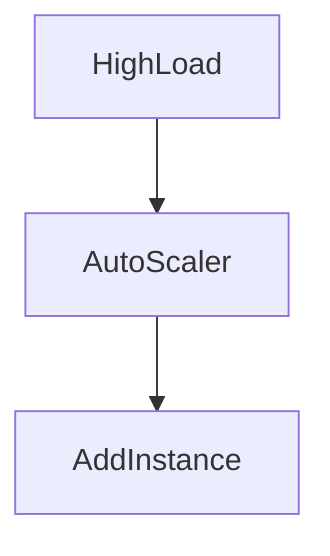

# Health Checks & Monitoring

> Goal: Understand how systems detect failures, monitor health, and automatically respond to changing load conditions.

---

## 6.2.1 Why Health Checks Matter ⭐⭐⭐⭐⭐

In distributed systems:

- Services may crash
- Services may hang
- Dependencies may fail
- Systems may become overloaded

If we do not detect unhealthy services:
- Traffic continues to be routed to them
- Users experience failures
- Cascading failures occur

> You cannot fix what you cannot detect.

---

## 6.2.2 What Is a Health Check?

A health check is a mechanism that:

- Determines whether a service is functioning correctly.
- Allows load balancers or orchestrators to route traffic appropriately.

---

# 6.2.3 Liveness vs Readiness Checks ⭐⭐⭐⭐⭐

This distinction is very important.

---

## 1️⃣ Liveness Check

Question:
> Is the service alive?

- Detects if the application is running.
- If liveness fails → restart the service.

Example:
- Process not responding
- Deadlock
- Crash

---

## 2️⃣ Readiness Check

Question:
> Is the service ready to handle traffic?

- Checks if dependencies are healthy.
- If readiness fails → stop routing traffic.
- Do NOT necessarily restart.

Example:
- Database unavailable
- Cache unavailable
- App still starting up

---

### Visual Difference

```mermaid
graph TD
    Service --> LivenessCheck
    Service --> ReadinessCheck
````

Liveness → restart
Readiness → remove from load balancer

---

## 6.2.4 Health Check in Load Balancing

Load balancer:

* Periodically checks each instance
* Routes traffic only to healthy nodes

```mermaid
graph TD
    LoadBalancer --> App1
    LoadBalancer --> App2
    App1 --> HealthCheck
    App2 --> HealthCheck
```

If App1 unhealthy → traffic routed to App2.

---

## 6.2.5 Monitoring Fundamentals ⭐⭐⭐⭐⭐

Monitoring answers:

* Is system healthy?
* Is latency increasing?
* Is error rate rising?
* Is CPU overloaded?

---

### Key Metrics to Monitor

1️⃣ Latency
2️⃣ Throughput
3️⃣ Error rate
4️⃣ CPU / Memory
5️⃣ Queue length

> These form the foundation of system observability.

---

## 6.2.6 Alerting

Monitoring without alerting is useless.

Alerts should trigger when:

* Error rate exceeds threshold
* Latency crosses SLA
* CPU utilization too high
* Disk full

Avoid:

* Alert fatigue
* Too many false alarms

---

## 6.2.7 Auto-Scaling Concepts ⭐⭐⭐⭐⭐

Auto-scaling adjusts system capacity based on load.

### Horizontal Scaling

Add/remove instances based on metrics.

Example:

* CPU > 70% → add instance
* CPU < 30% → remove instance



---

### Why Auto-Scaling Matters

* Handle traffic spikes
* Reduce cost during low load
* Improve availability

---

## 6.2.8 Example: Payment System Monitoring

Critical metrics:

* Payment success rate
* Transaction latency
* DB replication lag
* Queue backlog

If queue backlog increases:

* Add more consumers

If DB CPU spikes:

* Investigate bottleneck

---

## 6.2.9 Common Interview Mistakes ❌

❌ Confusing liveness with readiness
❌ Restarting service on readiness failure
❌ Not defining clear SLAs
❌ Ignoring monitoring until production

✅ Correct thinking:

* Liveness = restart
* Readiness = remove from traffic
* Monitor latency + errors + resource usage
* Auto-scale based on real metrics

---

## Key Takeaways ⭐⭐⭐⭐⭐

* Health checks detect failures early
* Liveness and readiness serve different purposes
* Monitoring tracks system performance
* Alerts notify engineers of issues
* Auto-scaling improves reliability and efficiency

---

## Interview-Ready One-Liners ⭐

* “Liveness restarts; readiness removes from traffic.”
* “Monitor latency, errors, and resource usage.”
* “Auto-scaling handles traffic spikes.”
* “Health checks prevent routing traffic to unhealthy nodes.”