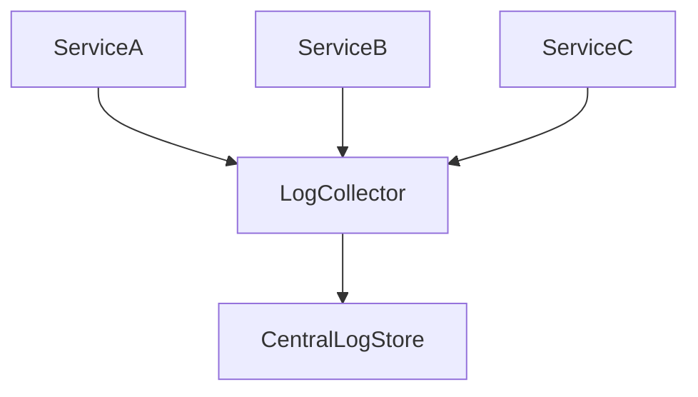

# Logging

> Goal: Understand why logging is essential in distributed systems and how structured and centralized logging improve observability.

---

# 9.1.1 Why Logging Matters ⭐⭐⭐⭐⭐

In distributed systems:

- Services run on multiple machines
- Failures happen asynchronously
- Bugs may not reproduce easily
- Requests flow across services

Without logs:
- Hard to debug issues
- No visibility into failures
- No audit trail

> Logs are the first line of defense in production debugging.

---

# 9.1.2 What Is a Log?

A log is a time-stamped record of:

- Events
- Errors
- Requests
- System behavior

Example:
```

2026-02-14 10:00:23 INFO Payment processed for orderId=123

```

---

# 9.1.3 Types of Logs

### 1️⃣ Application Logs
- Business logic events
- API requests
- Errors

### 2️⃣ System Logs
- CPU usage
- Memory usage
- OS-level events

### 3️⃣ Access Logs
- HTTP requests
- Response status codes
- Latency

---

# 9.1.4 Structured Logging ⭐⭐⭐⭐⭐

Instead of plain text logs:

```

User 123 logged in successfully

````

Use structured format (JSON):

```json
{
  "timestamp": "2026-02-14T10:00:23Z",
  "level": "INFO",
  "userId": 123,
  "event": "LOGIN_SUCCESS"
}
````

---

## Benefits of Structured Logging

* Easy to search
* Machine-readable
* Supports analytics
* Better filtering

> Always prefer structured logging in distributed systems.

---

# 9.1.5 Log Levels ⭐⭐⭐⭐

Common levels:

* DEBUG → Detailed diagnostic info
* INFO → Normal operation
* WARN → Potential issue
* ERROR → Failure occurred
* FATAL → System crash

Proper log levels help reduce noise.

---

# 9.1.6 Centralized Logging ⭐⭐⭐⭐⭐

In microservices:

* Logs spread across many machines
* SSH into each server is impractical

Solution:

* Collect logs into central system



---

## Benefits

* Unified visibility
* Faster debugging
* Easier search and filtering
* Historical analysis

---

# 9.1.7 Correlation ID (Very Important) ⭐⭐⭐⭐⭐

In distributed systems:

One request may pass through multiple services.

Without correlation ID:

* Hard to trace request flow.

Solution:

* Generate unique request ID
* Pass it through all services
* Include in logs

Example:

```
requestId=abc123
```

> Correlation IDs are critical for tracing request flow.

---

# 9.1.8 Logging Best Practices ⭐⭐⭐⭐⭐

* Use structured logs
* Include timestamps
* Include request ID
* Avoid logging sensitive data
* Set appropriate log levels
* Rotate logs regularly

---

# 9.1.9 What NOT to Log

Never log:

* Passwords
* Credit card numbers
* API keys
* JWT tokens
* Sensitive PII

Logging sensitive data creates security risks.

---

# 9.1.10 Logging in Payment System

Log:

* Payment ID
* Order ID
* Status
* Latency
* Errors

Do NOT log:

* Full card number
* CVV
* Raw authentication tokens

---

# 9.1.11 Common Interview Mistakes ❌

❌ Logging sensitive data
❌ Using plain text logs in distributed systems
❌ Ignoring correlation IDs
❌ Not differentiating log levels

✅ Correct thinking:

* Structured logs
* Centralized collection
* Correlation ID
* Secure logging

---

# Key Takeaways ⭐⭐⭐⭐⭐

* Logs are critical for debugging
* Use structured logging
* Centralize logs
* Include correlation IDs
* Avoid logging sensitive data

---

# Interview-Ready One-Liners ⭐

* “Use structured and centralized logging.”
* “Correlation IDs enable request tracing.”
* “Never log sensitive information.”
* “Logs are essential for production debugging.”