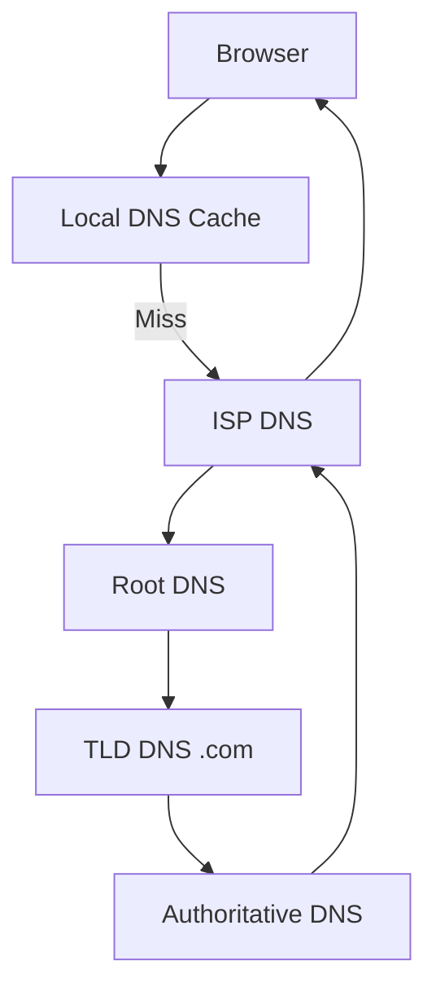
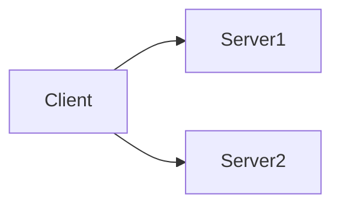
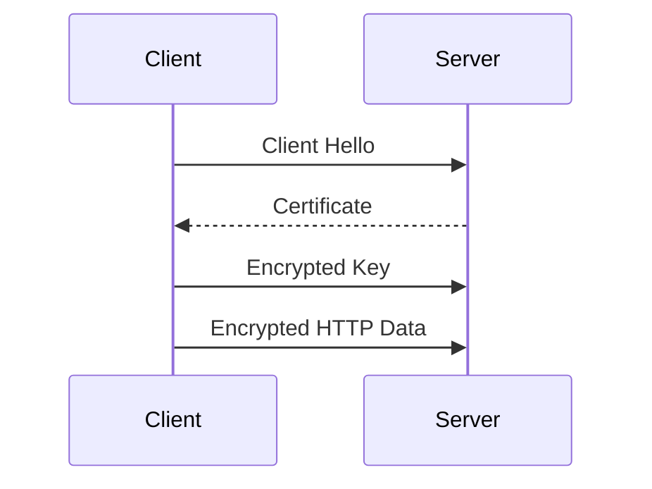

# MODULE 0.1: Networking Basics (System Design Foundation)

> Goal: Understand how data moves across the network and why networking decisions affect latency, scalability, and reliability in system design.

---

## 0.1.1 What Happens When You Type a URL in the Browser?

Example:
```

[https://www.google.com/search?q=system+design](https://www.google.com/search?q=system+design)

````

### Step-by-step Flow

1. Browser checks cache (DNS / HTTP cache)
2. DNS resolution (domain → IP)
3. TCP connection established
4. TLS handshake (if HTTPS)
5. HTTP request sent
6. Server processes request
7. HTTP response returned
8. Browser renders response

### High-Level Diagram

```mermaid
sequenceDiagram
    participant User
    participant Browser
    participant DNS
    participant Server

    User->>Browser: Enter URL
    Browser->>DNS: Resolve domain
    DNS-->>Browser: IP address
    Browser->>Server: TCP + HTTPS request
    Server-->>Browser: HTTP response
    Browser-->>User: Render page
````

### Why this matters in System Design

* DNS adds latency
* TCP + TLS handshakes cost time
* Every microservice call repeats part of this flow

---

## 0.1.2 IP Address & Ports

### IP Address

* Unique identifier of a machine on a network
* Example:

  ```
  142.250.182.14
  ```

### Port

* Identifies **which application** on the machine
* Examples:

  * HTTP → 80
  * HTTPS → 443
  * MySQL → 3306

```text
IP = which machine
Port = which app on that machine
```

### System Design Impact

* Load balancers route traffic using IP + port
* Firewalls allow/deny traffic using ports

---

## 0.1.3 DNS (Domain Name System)

### What DNS Does

Converts:

```
www.google.com → 142.250.182.14
```

### DNS Resolution Flow



### Important Points

* DNS results are cached (TTL)
* DNS failure = system unreachable
* Global systems rely heavily on DNS

### System Design Example

* Use **Geo-DNS** to route users to nearest data center

---

## 0.1.4 HTTP Protocol

### What is HTTP?

* Application-layer protocol
* Request–response based
* Stateless by default

### HTTP Request Example

```http
GET /users/123 HTTP/1.1
Host: api.example.com
Authorization: Bearer token
```

### HTTP Response Example

```http
HTTP/1.1 200 OK
Content-Type: application/json

{
  "id": 123,
  "name": "Abhi"
}
```

### Common HTTP Methods

* GET → Read
* POST → Create
* PUT → Update (full)
* PATCH → Update (partial)
* DELETE → Remove

---

## 0.1.5 Stateless vs Stateful Communication

### Stateless (Preferred in System Design)

* Server does not store client state
* Every request contains all required data

### Stateful

* Server stores session info
* Harder to scale



Stateless services allow:

* Easy horizontal scaling
* Load balancing

---

## 0.1.6 TCP vs UDP

### TCP (Transmission Control Protocol)

* Reliable
* Ordered
* Slower

Used for:

* HTTP / HTTPS
* Databases
* Payments

### UDP (User Datagram Protocol)

* Fast
* No guarantee
* No ordering

Used for:

* Video streaming
* Online games
* DNS (often)

| Feature     | TCP    | UDP    |
| ----------- | ------ | ------ |
| Reliability | Yes    | No     |
| Ordering    | Yes    | No     |
| Speed       | Slower | Faster |

### System Design Choice

* Financial systems → TCP
* Real-time systems → UDP

---

## 0.1.7 HTTPS & TLS (High Level)

### Problem with HTTP

* Data sent in plain text
* Vulnerable to attacks

### HTTPS Solution

* Uses TLS encryption
* Ensures:

  * Confidentiality
  * Integrity
  * Authentication



### System Design Rule

> Always use HTTPS — no exceptions.

---

## 0.1.8 Latency, Bandwidth & Throughput

### Latency

* Time taken for request to travel
* Measured in milliseconds

### Bandwidth

* Max data transfer capacity

### Throughput

* Actual data processed per second

Example:

* Payment system → low latency
* Analytics system → high throughput

---

## 0.1.9 REST Basics (System Design View)

### REST Principles

* Resource-based URLs
* Stateless
* Uses HTTP methods

Example:

```
GET /users/{id}
POST /payments
```

### Why REST is Popular

* Simple
* Scales well
* Language-agnostic

---

## Key Takeaways (VERY IMPORTANT)

* Networking adds **real latency**
* DNS, TCP, TLS all cost time
* Stateless services scale better
* TCP vs UDP is a **design choice**
* HTTPS is mandatory in production

---

## References & Deep-Dive Resources

### Articles

* [https://developer.mozilla.org/en-US/docs/Web/HTTP](https://developer.mozilla.org/en-US/docs/Web/HTTP)
* [https://www.cloudflare.com/learning/](https://www.cloudflare.com/learning/)
* [https://howdns.works/](https://howdns.works/)
* [https://www.geeksforgeeks.org/computer-network-tutorials/](https://www.geeksforgeeks.org/computer-network-tutorials/)

### Videos

* [https://www.youtube.com/watch?v=dh406O2v_1c](https://www.youtube.com/watch?v=dh406O2v_1c) (How the Internet Works)
* [https://www.youtube.com/watch?v=7_LPdttKXPc](https://www.youtube.com/watch?v=7_LPdttKXPc) (DNS Explained)
* [https://www.youtube.com/watch?v=2JYT5f2isg4](https://www.youtube.com/watch?v=2JYT5f2isg4) (HTTP vs HTTPS)

### Books (Optional)

* *Computer Networking: A Top-Down Approach*
* *Designing Data-Intensive Applications* (Networking concepts recur later)