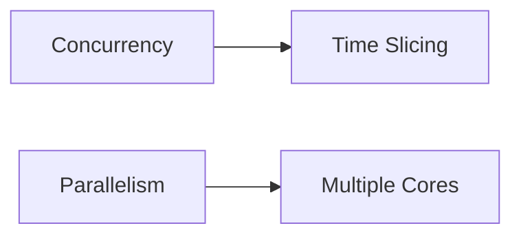
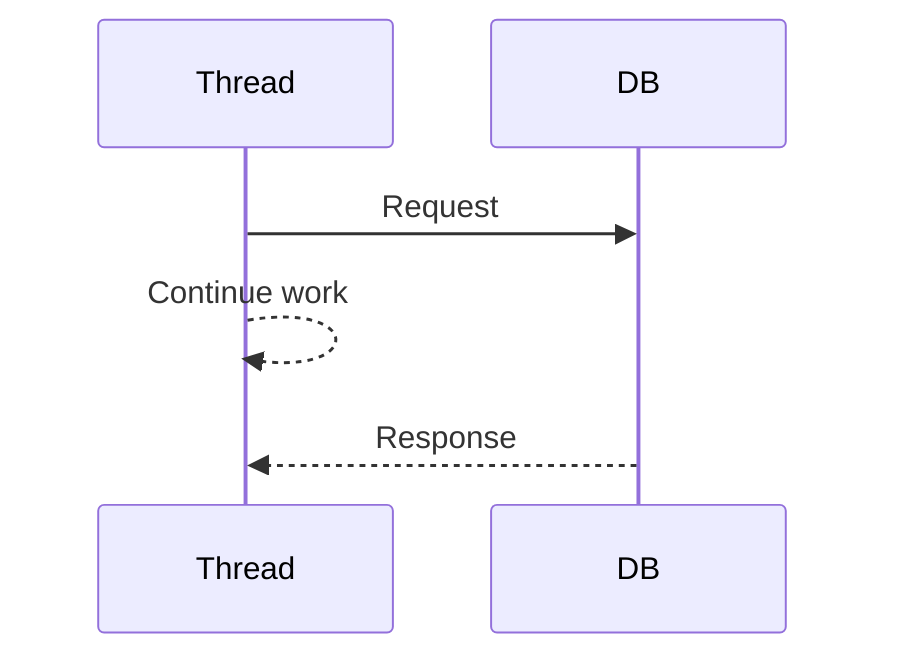
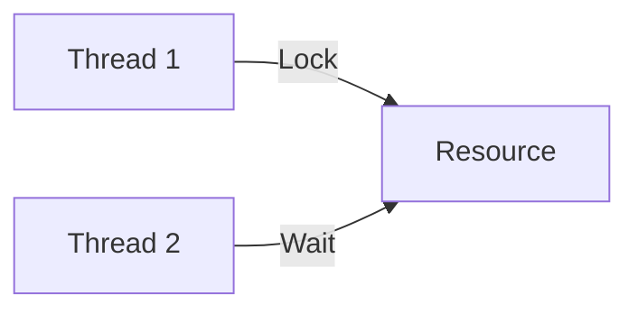
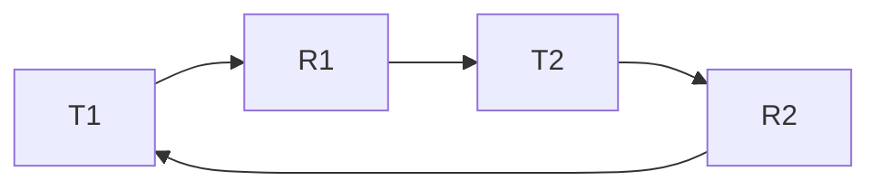

# MODULE 0.2: Operating System Basics (For System Design)

> Goal: Understand how OS concepts influence scalability, concurrency, performance, and reliability in distributed systems.

---

## 0.2.1 Why OS Concepts Matter in System Design

Even though system design looks “high level”, **every system ultimately runs on an OS**.

OS concepts affect:
- How many requests a service can handle
- How fast responses are
- How failures propagate
- How concurrency is managed

Example:
> A slow system is often not a design problem — it’s a **thread, blocking, or context-switching problem**.

---

## 0.2.2 Process vs Thread ⭐⭐⭐⭐⭐ (VERY IMPORTANT)

### Process
- A process in an operating system is an instance of a computer program in execution, representing the active, fundamental unit of work
- Independent execution unit
- Has its own memory space
- Heavyweight

### Thread
- A thread is the smallest, independent unit of CPU utilization in an operating system, representing a single, sequential flow of control within a process
- Lightweight unit inside a process
- Shares memory with other threads
- Faster to create & switch

### Diagram

```mermaid
graph TD
    P[Process]
    P --> T1[Thread 1]
    P --> T2[Thread 2]
    P --> T3[Thread 3]
````

### Real-World Mapping

* **Spring Boot app** → Process
* **Request handlers** → Threads

### System Design Insight ⭐

* More threads ≠ better performance
* Thread management impacts latency

---

## 0.2.3 Context Switching

### What is Context Switching?

Switching CPU from one thread/process to another.

### Cost

* CPU saves current state
* Loads next state
* Cache invalidation

```mermaid
sequenceDiagram
    CPU->>Thread1: Execute
    CPU->>Thread2: Switch
    CPU->>Thread3: Switch
```

### Why It Matters

* Too many threads → high context switching
* High context switching → poor performance

### Interview Line ⭐

> Excessive context switching can degrade system performance even on powerful machines.

---

## 0.2.4 Concurrency vs Parallelism ⭐⭐⭐⭐

### Concurrency

* Multiple tasks **in progress**
* Managed via time-slicing
* Single core possible

### Parallelism

* Multiple tasks **executing simultaneously**
* Requires multiple CPU cores



### System Design Example

* Async APIs → concurrency
* Batch processing → parallelism

---

## 0.2.5 Blocking vs Non-Blocking I/O ⭐⭐⭐⭐⭐

### Blocking I/O

* Thread waits until operation completes
* Thread is unusable meanwhile

Example:

```text
Thread waits for DB response
```

### Non-Blocking I/O

* Thread initiates operation
* Continues doing other work
* Callback / event used



### Why This is CRITICAL

* Blocking → fewer concurrent requests
* Non-blocking → higher throughput

### Real-World

* Traditional servlet model → blocking
* Reactive systems → non-blocking

---

## 0.2.6 CPU-Bound vs I/O-Bound Workloads

### CPU-Bound

* Heavy computation
* Uses CPU intensely

Examples:

* Encryption
* Image processing

### I/O-Bound

* Waiting for external systems

Examples:

* DB calls
* API calls

### System Design Insight

* Most backend systems are **I/O-bound**
* Optimize by:

  * Async calls
  * Connection pooling

---

## 0.2.7 Locks, Mutex & Synchronization (High Level)

### Why Locks Exist

* Shared memory between threads
* Prevent race conditions

### Problems with Locks

* Reduced parallelism
* Deadlocks
* Performance bottlenecks



### System Design Rule ⭐

> Prefer statelessness and immutability over locks.

---

## 0.2.8 Deadlocks (Must Understand Conceptually)

### Deadlock Conditions

1. Mutual exclusion
2. Hold and wait
3. No preemption
4. Circular wait

### Detailed explaination from geeks-for-geeks
```x
1. Mutual Exclusion

Mutual Exclusion condition requires that at least one resource be held in a non-shareable mode, which means that only one process can use the resource at any given time. Both Resource 1 and Resource 2 are non-shareable in our scenario, and only one process can have exclusive access to each resource at any given time. As an example:

    Process 1 obtains Resource 1.
    Process 2 acquires Resource 2.

2. Hold and Wait

The hold and wait condition specifies that a process must be holding at least one resource while waiting for other processes to release resources that are currently held by other processes. In our example,

    Process 1 has Resource 1 and is awaiting Resource 2.
    Process 2 currently has Resource 2 and is awaiting Resource 1.
    Both processes hold one resource while waiting for the other, satisfying the hold and wait condition.

3. No Preemption

Preemption is the act of taking a resource from a process before it has finished its task. According to the no preemption condition, resources cannot be taken forcibly from a process a process can only release resources voluntarily after completing its task.

For example – Process p1 have resource r1 and requesting for r2 that is hold by process p2. then process p1 can not preempt resource r2 until process p2 can finish his execution. After some time it try to restart by requesting both r1 and r2 resources.

Problem – This can cause the Live Lock Problem .
What is Live Lock?

Live lock is the situation where two or more processes continuously changing their state in response to each other without making any real progress. Example:

    Suppose there are two processes 1 and 2 and two resources r1 and r2.
    Now, p1 acquired r1 and need r2 & p2 acquired r2 and need r1.
    so according to above method- Both p1 and p2 detect that they can’t acquire second resource, so they release resource that they are holding and then try again.
    continuous cycle- p1 again acquired r1 and requesting to r2 p2 again acquired r2 and requesting to r1 so there is no overall progress still process are changing there state as they preempt resources and then again holding them. This the situation of Live Lock.

4. Circular Wait

Circular wait is a condition in which a set of processes are waiting for resources in such a way that there is a circular chain, with each process in the chain holding a resource that the next process needs. This is one of the necessary conditions for a deadlock to occur in a system.
```



### Why It Matters

* Thread pools can freeze
* Requests pile up
* System becomes unresponsive

---

## 0.2.9 Thread Pools ⭐⭐⭐⭐

### Why Thread Pools?

* Thread creation is expensive
* Control concurrency

### How Thread Pools Help

* Reuse threads
* Limit max concurrency
* Prevent resource exhaustion

### System Design Example

* Web server thread pool
* DB connection pool

---

## 0.2.10 OS Concepts Mapped to System Design

| OS Concept        | System Design Impact |
| ----------------- | -------------------- |
| Threads           | Request handling     |
| Blocking I/O      | Latency              |
| Context switching | Throughput           |
| Locks             | Scalability          |
| Thread pools      | Stability            |

---

## Key Takeaways (VERY IMPORTANT)

* Threads are not free
* Blocking I/O kills scalability
* Context switching hurts performance
* Most backend systems are I/O-bound
* Thread pools protect systems from overload

---

## Interview-Ready One-Liners ⭐

* “Blocking calls reduce concurrency.”
* “Thread pools prevent resource exhaustion.”
* “Most backend services are I/O-bound, not CPU-bound.”
* “Excessive threads cause context switching overhead.”

---

## References & Deep-Dive Resources

### Articles

* [https://www.geeksforgeeks.org/process-vs-thread/](https://www.geeksforgeeks.org/process-vs-thread/)
* [https://www.baeldung.com/java-blocking-non-blocking](https://www.baeldung.com/java-blocking-non-blocking)
* [https://www.cloudflare.com/learning/performance/what-is-latency/](https://www.cloudflare.com/learning/performance/what-is-latency/)

### Videos

* [https://www.youtube.com/watch?v=FChZP09Ba4E](https://www.youtube.com/watch?v=FChZP09Ba4E) (Processes vs Threads)
* [https://www.youtube.com/watch?v=7ENFeb-J75k](https://www.youtube.com/watch?v=7ENFeb-J75k) (Concurrency vs Parallelism)
* [https://www.youtube.com/watch?v=3X93PnKRNUo](https://www.youtube.com/watch?v=3X93PnKRNUo) (Blocking vs Non-Blocking I/O)

### Books (Optional)

* *Operating Systems: Three Easy Pieces*
* *Designing Data-Intensive Applications* (Concurrency concepts)

