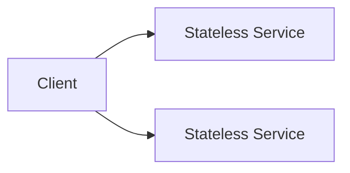
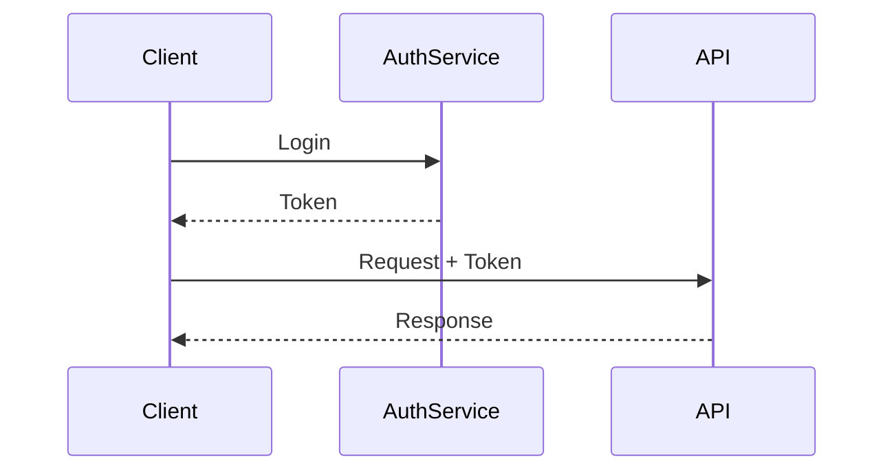
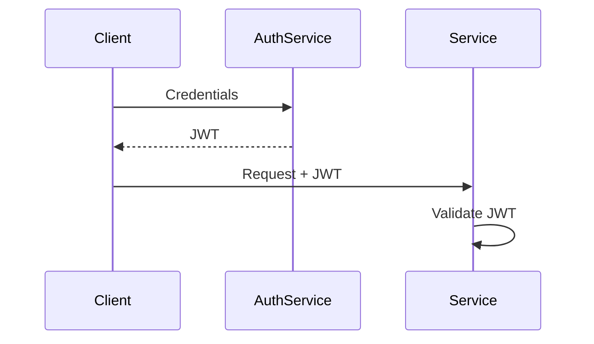
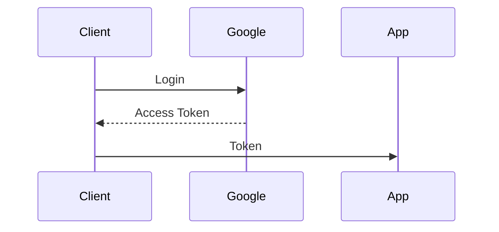
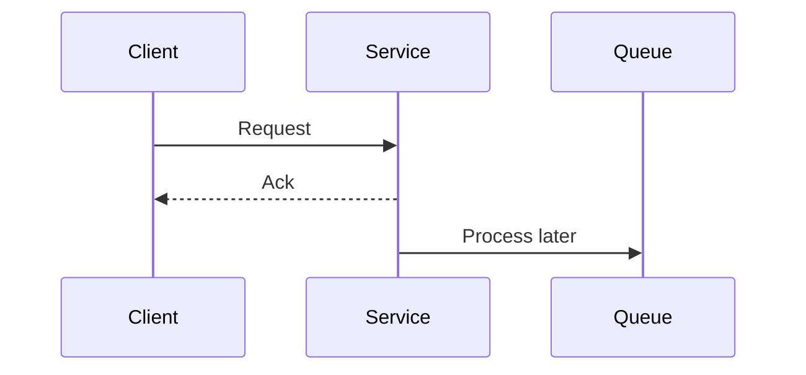

## 0.3.1 What is a Backend Service?

A backend service:
- Exposes APIs
- Processes business logic
- Communicates with databases & other services
- Runs continuously as a server process

Examples:
- User Service
- Payment Service
- Order Service

---

## 0.3.2 Monolith vs Microservices (High Level)

### Monolith
- Single deployable unit
- All features in one codebase

### Microservices
- Multiple small, independent services
- Each service owns a specific domain

```mermaid
graph TD
    A[Client] --> M[Monolith]
````

```mermaid
graph TD
    A[Client] --> U[User Service]
    A --> P[Payment Service]
    A --> O[Order Service]
```

### System Design Insight ⭐

> Microservices improve scalability and isolation but increase operational complexity.

---

## 0.3.3 Stateless vs Stateful Services ⭐⭐⭐⭐⭐

### Stateless Service

* No client session stored in memory
* Each request is independent

### Stateful Service

* Stores session/state in memory



### Why Stateless Wins

* Easy horizontal scaling
* Works well with load balancers
* Fault tolerant

---

## 0.3.4 API Design Basics (System Design View)

### Resource-Based APIs

Use nouns, not verbs.

Good:

```
GET /users/{id}
POST /payments
```

Bad:

```
GET /getUser
POST /makePayment
```

### Versioning APIs

```
/v1/payments
/v2/payments
```

### Why Versioning Matters

* Backward compatibility
* Safe evolution of systems

---

## 0.3.5 Authentication vs Authorization ⭐⭐⭐⭐

### Authentication

> Who are you?

Examples:

* Username/password
* Token

### Authorization

> What are you allowed to do?

Examples:

* Role-based access
* Permissions



---

## 0.3.6 JWT (JSON Web Token) – High Level

### What is JWT?

* Self-contained token
* Signed (not encrypted by default)

### JWT Flow



### Why JWT is Popular

* Stateless authentication
* Scales well
* No session storage needed

---

## 0.3.7 OAuth (High Level Concept)

### What OAuth Solves

* Secure third-party access
* No password sharing

Example:

* “Login with Google”



### System Design Insight

* OAuth is complex
* Usually handled by identity providers

---

## 0.3.8 Synchronous vs Asynchronous APIs

### Synchronous

* Client waits for response

### Asynchronous

* Client gets acknowledgment
* Processing happens later



### When to Use Async

* Long-running tasks
* Non-critical operations
* High traffic systems

---

## 0.3.9 Inter-Service Communication

### Common Methods

* REST over HTTP
* gRPC
* Messaging (queues)

### Trade-offs

* REST → simple, slower
* gRPC → fast, complex
* Messaging → async, decoupled

---

## 0.3.10 Configuration & Secrets (High Level)

### Configuration

* Environment variables
* Config servers

### Secrets

* Passwords
* API keys
* Certificates

### System Design Rule ⭐

> Never hardcode secrets in code.

---

## Key Takeaways (VERY IMPORTANT)

* Stateless services scale best
* APIs should be resource-oriented
* Authentication ≠ Authorization
* JWT enables stateless auth
* Async APIs improve scalability

---

## Interview-Ready One-Liners ⭐

* “Stateless services are easier to scale horizontally.”
* “JWT avoids server-side session storage.”
* “AuthN and AuthZ solve different problems.”
* “Async APIs improve throughput under load.”

---

## References & Deep-Dive Resources

### Articles

* [https://restfulapi.net/](https://restfulapi.net/)
* [https://jwt.io/introduction](https://jwt.io/introduction)
* [https://auth0.com/docs](https://auth0.com/docs)
* [https://martinfowler.com/articles/microservices.html](https://martinfowler.com/articles/microservices.html)

### Videos

* [https://www.youtube.com/watch?v=Q-BpqyOT3a8](https://www.youtube.com/watch?v=Q-BpqyOT3a8) (REST API Design)
* [https://www.youtube.com/watch?v=soGRyl9ztjI](https://www.youtube.com/watch?v=soGRyl9ztjI) (JWT Explained)
* [https://www.youtube.com/watch?v=996OiexH2xs](https://www.youtube.com/watch?v=996OiexH2xs) (OAuth 2.0)

### Books

* *Designing Data-Intensive Applications*
* *Building Microservices* – Sam Newman

---

