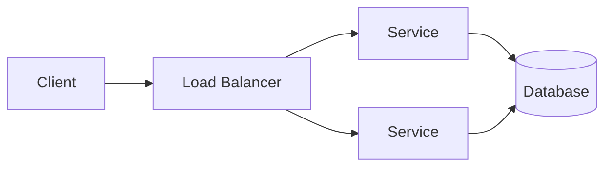
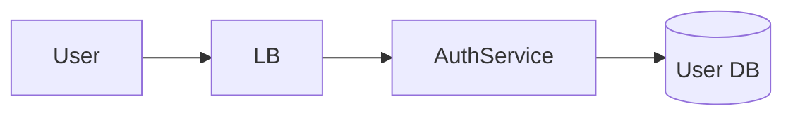

## 1.1.1 What Is System Design?

**System Design** is the process of defining:
- System components
- Their interactions
- Data flow
- Trade-offs

to meet:
- Functional requirements
- Non-functional requirements

> System design is about **decisions**, not diagrams.

---

## 1.1.2 Why System Design Matters

In real systems:
- Traffic grows
- Failures happen
- Data increases
- Latency becomes critical

Good system design ensures:
- Scalability
- Reliability
- Maintainability
- Performance

Bad system design:
- Works in dev
- Fails in production

---

## 1.1.3 Functional vs Non-Functional Requirements ⭐⭐⭐⭐⭐

### Functional Requirements (WHAT the system does)
Examples:
- User can make a payment
- User can send a message
- System stores transaction history

### Non-Functional Requirements (HOW WELL it does it)
Examples:
- Handles 1M users
- Response time < 200ms
- 99.99% availability
- Secure & fault tolerant

```mermaid
graph TD
    A[System Requirements]
    A --> B[Functional]
    A --> C[Non-Functional]
````

### Interview Rule ⭐

> Always clarify **non-functional requirements first**.

---

## 1.1.4 Common Non-Functional Requirements (VERY IMPORTANT)

| Requirement  | Meaning                |
| ------------ | ---------------------- |
| Scalability  | Handle growth          |
| Availability | System is accessible   |
| Reliability  | System works correctly |
| Latency      | Response time          |
| Throughput   | Requests per second    |
| Consistency  | Data correctness       |
| Durability   | Data not lost          |
| Security     | Protected data         |

Interviewers expect you to **name these confidently**.

---

## 1.1.5 Types of System Design Questions

### 1. High-Level Design (HLD)

* Design WhatsApp
* Design Payment Gateway
* Design URL Shortener

Focus:

* Components
* Data flow
* Scaling strategy

---

### 2. Low-Level Design (LLD)

* Class diagrams
* APIs
* DB schemas

Focus:

* Implementation details

> This course focuses mainly on **HLD**, with practical LLD insights.

---

## 1.1.6 How Interviewers Evaluate System Design

They are NOT checking:
❌ Perfect architecture
❌ Exact AWS services

They ARE checking:
✅ Structured thinking
✅ Trade-off awareness
✅ Scalability understanding
✅ Failure handling

---

## 1.1.7 The Golden System Design Flow ⭐⭐⭐⭐⭐

Always follow this order 👇

```mermaid
flowchart TD
    A[Clarify Requirements]
    B[Estimate Scale]
    C[High-Level Design]
    D[Data Design]
    E[Detailed Components]
    F[Scaling Strategy]
    G[Failure Handling]

    A --> B --> C --> D --> E --> F --> G
```

If you skip steps → **red flag in interviews** 🚩

---

## 1.1.8 Step 1: Clarify Requirements (MOST IMPORTANT)

Never start drawing immediately.

Ask:

* Who are the users?
* Core features?
* Read-heavy or write-heavy?
* Latency expectations?
* Consistency expectations?

Example (Payment System):

* Is it real-time?
* Exactly-once required?
* Daily volume?

---

## 1.1.9 Step 2: Estimate Scale (Back-of-the-Envelope)

Interviewers LOVE this.

Estimate:

* Number of users
* Requests per second (RPS)
* Data size

Example:

```
1M users
10. requests/user/day
≈ 115 RPS
```

> Estimation shows engineering maturity.

---

## 1.1.10 Step 3: High-Level Architecture

Start with:

* Client
* Load balancer
* Services
* Databases



---

## 1.1.11 Step 4: Identify Bottlenecks

Ask:

* What fails first?
* Where is the SPOF?
* What doesn’t scale?

Common bottlenecks:

* Database
* Shared state
* Synchronous calls

---

## 1.1.12 Step 5: Trade-offs (THIS SEPARATES SENIORS)

Every decision has trade-offs.

Examples:

* SQL vs NoSQL
* Consistency vs Availability
* Sync vs Async

Interview Gold Line ⭐

> There is no perfect system, only well-chosen trade-offs.

---

## 1.1.13 Example: Login System (Very Simple)

### Requirements

* Users login
* Secure
* Scalable

### High-Level Design



### Trade-offs

* JWT vs session
* Cache user data or not

---

## Key Takeaways ⭐⭐⭐⭐⭐

* System design = structured decision making
* Non-functional requirements drive architecture
* Always clarify before designing
* Estimation is mandatory
* Trade-offs matter more than diagrams

---

## Interview-Ready One-Liners ⭐

* “I’ll start by clarifying requirements.”
* “Let’s estimate the scale.”
* “The main bottleneck here is…”
* “This is a trade-off between X and Y.”

---

## References & Deep-Dive Resources

### Articles

* [https://martinfowler.com/architecture/](https://martinfowler.com/architecture/)
* [https://www.geeksforgeeks.org/system-design-tutorial/](https://www.geeksforgeeks.org/system-design-tutorial/)
* [https://www.educative.io/blog/system-design-interview](https://www.educative.io/blog/system-design-interview)

### Videos

* [https://www.youtube.com/watch?v=MbjObHmDbZo](https://www.youtube.com/watch?v=MbjObHmDbZo) (System Design Basics)
* [https://www.youtube.com/watch?v=UzLMhqg3_Wc](https://www.youtube.com/watch?v=UzLMhqg3_Wc) (Interview Approach)

### Books

* *Designing Data-Intensive Applications* – Martin Kleppmann
* *System Design Interview* – Alex Xu
