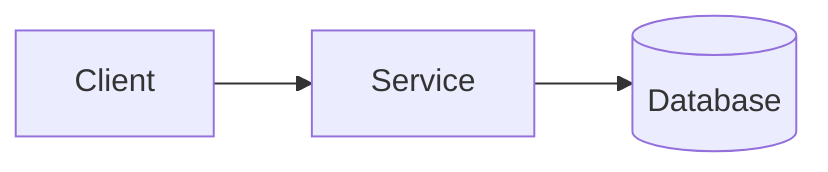
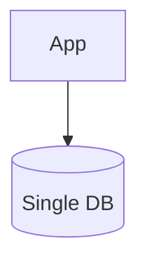
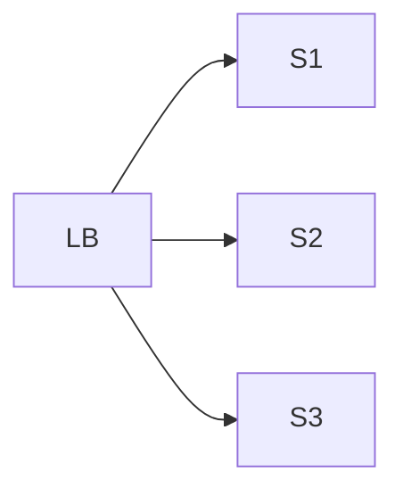
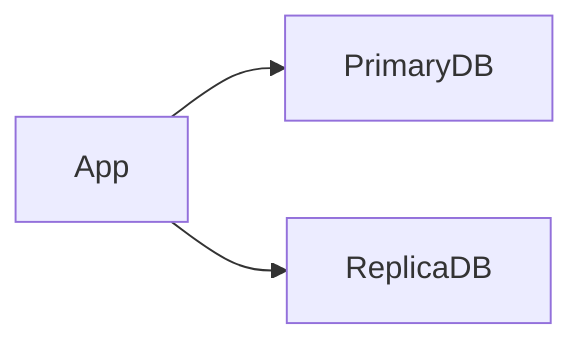
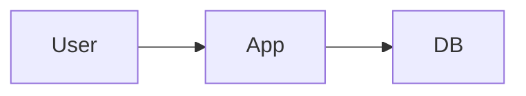
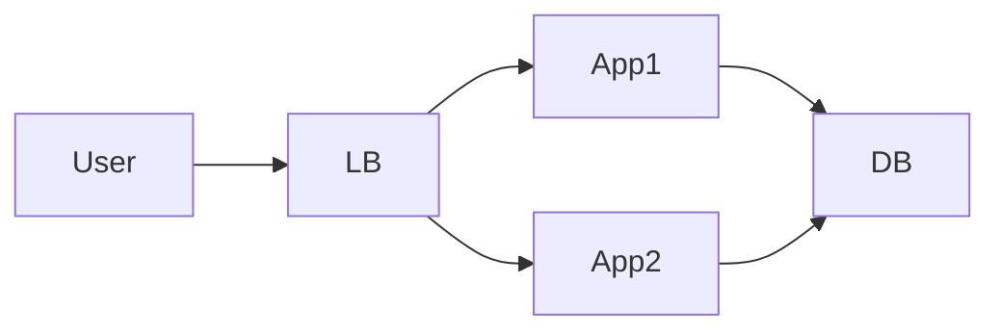

## 1.2.1 What Is Scalability?

**Scalability** is a system’s ability to handle:
- More users
- More requests
- More data

without:
- Performance degradation
- Major redesign

> A system that works for 100 users but fails at 10,000 users is **not scalable**.

---

## 1.2.2 Why Scalability Matters

Real-world reality:
- User growth is unpredictable
- Traffic spikes happen
- Marketing campaigns break systems 😄

Good scalability:
- Handles growth smoothly
- Costs less long-term

---

## 1.2.3 Types of Scaling ⭐⭐⭐⭐⭐

### Vertical Scaling (Scale Up)

Add more resources to one machine:
- More CPU
- More RAM
- Bigger disk

```mermaid
graph TD
    S[Server] --> S2[More CPU/RAM]
````

#### Pros

* Simple
* No code changes

#### Cons

* Hardware limits
* Single Point of Failure
* Expensive

---

### Horizontal Scaling (Scale Out) ⭐⭐⭐⭐⭐

Add more machines:

* More servers
* Same code

```mermaid
graph LR
    LB[Load Balancer] --> S1[Server 1]
    LB --> S2[Server 2]
    LB --> S3[Server 3]
```

#### Pros

* Highly scalable
* Fault tolerant
* Industry standard

#### Cons

* Requires stateless services
* More complexity

---

### Interview Gold Line ⭐

> Horizontal scaling is preferred for large-scale distributed systems.

---

## 1.2.4 Load: What Are We Scaling For?

### Common Load Metrics

| Metric           | Meaning             |
| ---------------- | ------------------- |
| QPS / RPS        | Requests per second |
| Concurrent users | Active users        |
| Data size        | Storage growth      |
| Traffic pattern  | Spikes vs steady    |

### Example

```
1M users
10 requests/user/day
≈ 115 RPS
```

---

## 1.2.5 Read vs Write Heavy Systems ⭐⭐⭐⭐

### Read-Heavy

* Many reads
* Fewer writes

Examples:

* Social media feeds
* Product catalogs

### Write-Heavy

* Many writes

Examples:

* Logging systems
* Analytics ingestion

### Design Impact

* Read-heavy → caching, replicas
* Write-heavy → sharding, async writes

---

## 1.2.6 Bottlenecks (MOST IMPORTANT)

A **bottleneck** is the first thing that breaks under load.

### Common Bottlenecks

* Database
* Network
* CPU
* Disk I/O
* Locks



> In most systems, **the database is the first bottleneck**.

---

## 1.2.7 Single Point of Failure (SPOF)

### What is SPOF?

A component whose failure brings down the system.

### Example

* Single DB
* Single server



### Fix

* Replication
* Redundancy

---

## 1.2.8 Scaling Stateless Services ⭐⭐⭐⭐⭐

Stateless services:

* Store no client state
* Can be scaled horizontally easily



### Why Interviewers Love This

* Easy to explain
* Industry best practice

---

## 1.2.9 Scaling Stateful Components (Hard Part)

### Databases Are Stateful

* Cannot just add DBs randomly

Scaling strategies:

* Read replicas
* Sharding
* Caching



> Databases scale **differently** than services.

---

## 1.2.10 Scale vs Performance vs Availability

These are related but different.

| Concept      | Meaning       |
| ------------ | ------------- |
| Performance  | How fast      |
| Scalability  | How much load |
| Availability | How often up  |

Example:

* A fast system can still crash under load
* A scalable system may have higher latency

---

## 1.2.11 Over-Scaling vs Under-Scaling

### Over-Scaling

* Too many components
* High cost
* Complex

### Under-Scaling

* System crashes
* Poor user experience

### Interview Insight ⭐

> Start simple, scale incrementally.

---

## 1.2.12 Real Example: Login System Scaling

### Initial Design



### Scaled Design



Next bottleneck?
👉 Database → solved later with caching & replicas.

---

## Key Takeaways ⭐⭐⭐⭐⭐

* Scalability ≠ performance
* Horizontal scaling is preferred
* Bottlenecks appear one-by-one
* Databases are hardest to scale
* Stateless services enable scale

---

## Interview-Ready One-Liners ⭐

* “We scale services horizontally.”
* “The database is the main bottleneck.”
* “Stateless services enable easy scaling.”
* “Scaling is about handling growth, not speed.”

---

## References & Deep-Dive Resources

### Articles

* [https://www.geeksforgeeks.org/scalability-in-system-design/](https://www.geeksforgeeks.org/scalability-in-system-design/)
* [https://www.cloudflare.com/learning/performance/what-is-scalability/](https://www.cloudflare.com/learning/performance/what-is-scalability/)
* [https://aws.amazon.com/what-is/scalability/](https://aws.amazon.com/what-is/scalability/)

### Videos

* [https://www.youtube.com/watch?v=HhK4J6V6qYk](https://www.youtube.com/watch?v=HhK4J6V6qYk) (Scalability Explained)
* [https://www.youtube.com/watch?v=E8vS0xNqzXU](https://www.youtube.com/watch?v=E8vS0xNqzXU) (Vertical vs Horizontal Scaling)

### Books

* *Designing Data-Intensive Applications*
* *System Design Interview – Alex Xu*