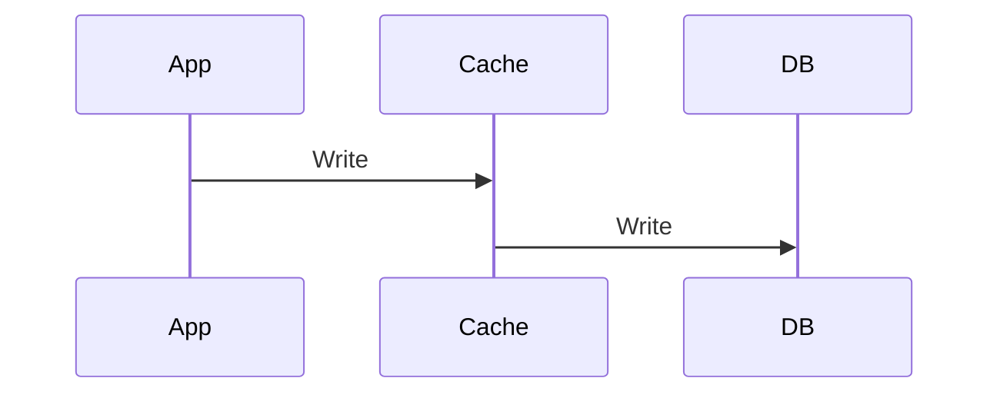
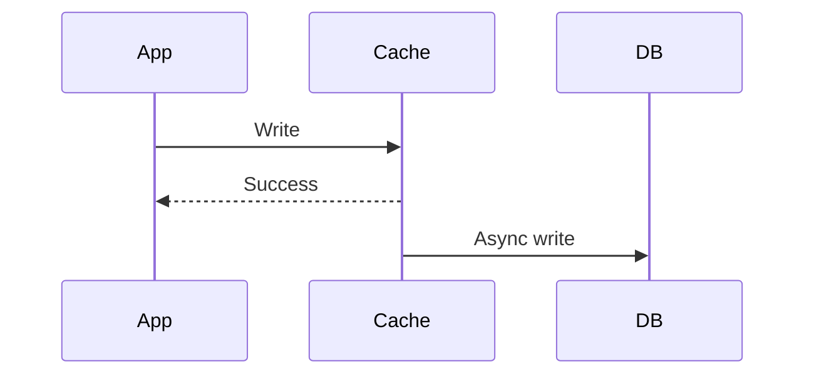
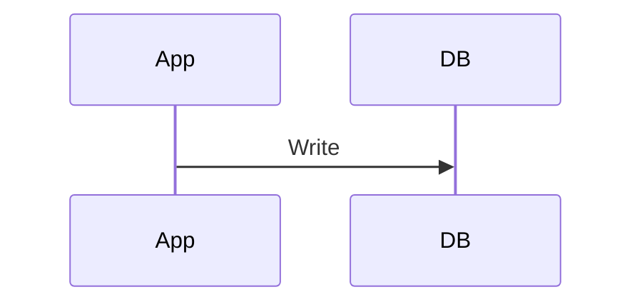

# Caching Patterns

> Goal: Understand different caching patterns, how they work, and when to use each pattern in system design.

---

## 4.3.1 Why Caching Patterns Matter ⭐⭐⭐⭐⭐

Caching is not just about storing data —  
it’s about **how the cache interacts with the database**.

Different patterns impact:
- Consistency
- Latency
- Write performance
- Failure handling

Choosing the wrong pattern can cause:
- Stale data
- Data loss
- Performance bottlenecks

---

# 4.3.2 Cache-Aside (Lazy Loading) ⭐⭐⭐⭐⭐

## How It Works

1. Application checks cache
2. On miss → fetch from DB
3. Store in cache
4. On write → update DB, then invalidate cache

```mermaid
sequenceDiagram
    App->>Cache: Get(key)
    Cache-->>App: Miss
    App->>DB: Query
    DB-->>App: Data
    App->>Cache: Set(key)
````

Write flow:

```mermaid
sequenceDiagram
    App->>DB: Update
    App->>Cache: Delete(key)
```

---

## Benefits

* Simple to implement
* Good read performance
* Most commonly used pattern

## Drawbacks

* Cache miss penalty
* Stale data risk

> This is the most widely used caching pattern.

---

# 4.3.3 Write-Through Cache ⭐⭐⭐⭐

## How It Works

* Write goes to cache
* Cache synchronously writes to DB



---

## Benefits

* Cache always consistent with DB
* No cache misses after writes

## Drawbacks

* Higher write latency
* Cache stores rarely-used data

---

# 4.3.4 Write-Back (Write-Behind) Cache ⭐⭐⭐⭐

## How It Works

* Write to cache only
* Cache asynchronously writes to DB later



---

## Benefits

* Very fast writes
* High throughput

## Drawbacks

* Risk of data loss
* Complex failure handling
* Not ideal for critical data

> Used in high-performance systems like logging.

---

# 4.3.5 Write-Around Cache ⭐⭐⭐

## How It Works

* Writes go directly to DB
* Cache updated only on read



---

## Benefits

* Avoids polluting cache with rarely-read data
* Good for write-heavy workloads

## Drawbacks

* First read is slow
* Possible cache miss spike

---

# 4.3.6 Pattern Comparison ⭐⭐⭐⭐⭐

| Pattern       | Read Speed | Write Speed | Consistency | Use Case            |
| ------------- | ---------- | ----------- | ----------- | ------------------- |
| Cache-Aside   | Fast       | Medium      | Eventual    | Most apps           |
| Write-Through | Fast       | Slower      | Stronger    | Critical reads      |
| Write-Back    | Very Fast  | Very Fast   | Risky       | High throughput     |
| Write-Around  | Medium     | Fast        | Medium      | Write-heavy systems |

---

# 4.3.7 Choosing the Right Pattern

Ask:

1. Is data critical?
2. Is workload read-heavy or write-heavy?
3. Is eventual consistency acceptable?
4. Can system tolerate data loss?

---

# 4.3.8 Caching Pattern in Payment System

Use:

* Cache-aside for user profile
* Write-through for configuration
* Never use write-back for balances

> Financial data should not rely on asynchronous writes.

---

# 4.3.9 Common Interview Mistakes ❌

❌ Using write-back for critical data
❌ Forgetting to invalidate cache
❌ Assuming cache is always consistent
❌ Not handling cache failures

✅ Correct thinking:

* DB is source of truth
* Choose pattern based on workload
* Understand consistency trade-offs

---

# Key Takeaways ⭐⭐⭐⭐⭐

* Cache-aside is most common
* Write-through improves consistency
* Write-back improves performance but risky
* Write-around avoids cache pollution
* Pattern choice depends on workload

---

# Interview-Ready One-Liners ⭐

* “Cache-aside is the most common pattern.”
* “Write-back improves write throughput but risks durability.”
* “Write-through improves consistency at cost of latency.”
* “Choose pattern based on workload.”