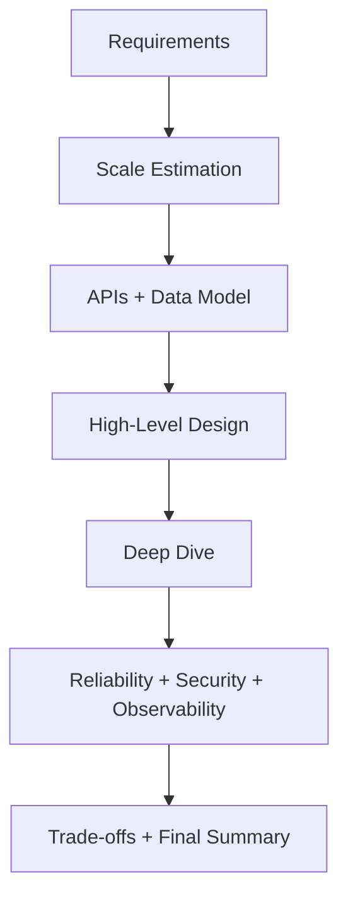

# How to Approach a System Design Interview

> Goal: Learn a repeatable interview framework that shows clarity, depth, and trade-off-driven thinking.

---

## 17.1.1 Recommended Interview Flow

Use this sequence consistently:

1. Clarify functional requirements
2. Clarify non-functional requirements
3. Estimate scale (QPS, storage, peak traffic)
4. Define APIs and data model
5. Draw high-level architecture
6. Deep dive into bottlenecks
7. Discuss reliability, security, and observability
8. Explain trade-offs and alternatives

---

## 17.1.2 Clarifying Questions (Must Ask)

- What are the most important user actions?
- What scale should we assume (DAU/QPS/data size)?
- Is consistency or availability more important?
- What latency target is acceptable?
- Any compliance/security constraints?

> Strong candidates ask questions before drawing architecture.

---

## 17.1.3 End-to-End Interview Structure

---

## 17.1.4 What Interviewers Evaluate

- Structured communication
- Correctness and completeness
- Trade-off awareness
- Handling of failure modes
- Practical production thinking

---

## 17.1.5 Common Interview Mistakes ❌

❌ Jumping to databases before requirements
❌ Skipping scale estimates
❌ Ignoring failures and recovery
❌ Presenting one design with no alternatives
