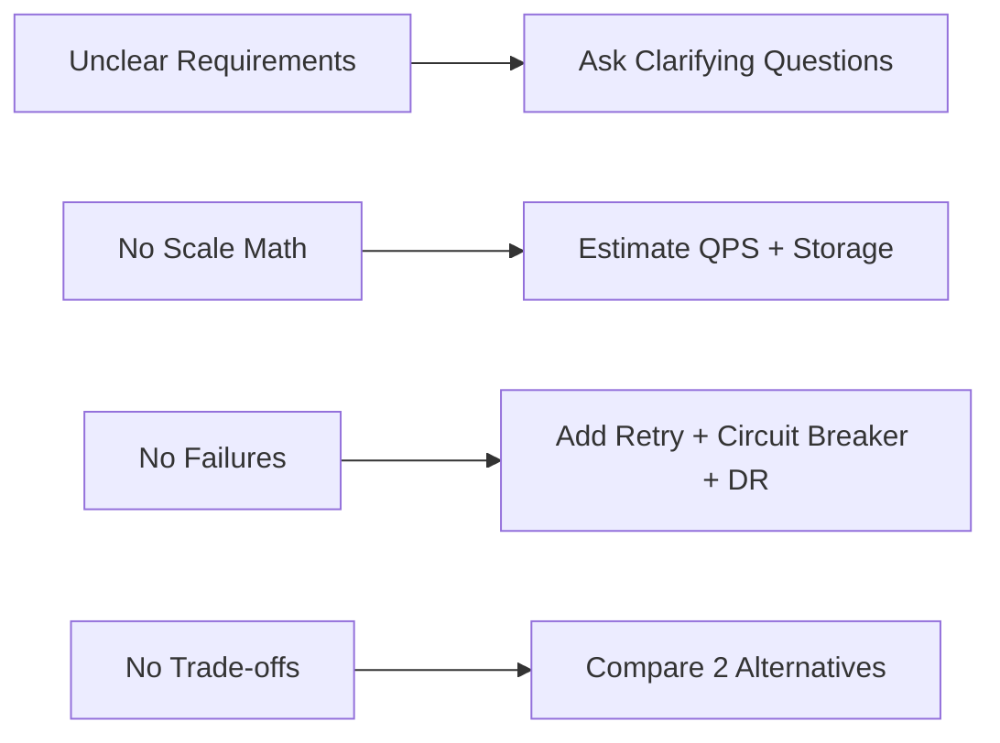

# Common System Design Interview Mistakes

> Goal: Avoid predictable mistakes that lower interview performance even when technical knowledge is good.

---

## 17.2.1 Top Mistakes

1. No requirements clarification
2. No traffic/storage estimation
3. Over-engineering too early
4. Ignoring failure scenarios
5. No mention of observability
6. No security considerations
7. No trade-off discussion

---

## 17.2.2 Over-Engineering Trap

Candidates often introduce:
- Multi-region systems too early
- Complex consensus protocols without need
- Excessive microservice decomposition

Start simple, then scale the design only when constraints demand it.

---

## 17.2.3 Mistake-to-Fix Mapping

---

## 17.2.4 Recovery Strategy During Interview

If you realize you made a mistake mid-interview:
- Acknowledge it clearly
- Correct the assumption
- Re-evaluate impacted components
- Continue confidently

Interviewers value correction and reasoning.

---

## 17.2.5 Common Interview Mistakes ❌

❌ Defending a wrong assumption too long
❌ Ignoring interviewer hints
❌ Not summarizing final architecture
