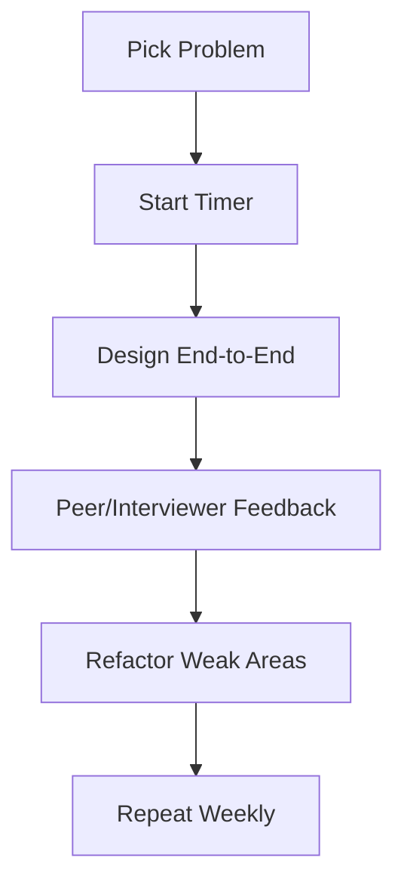

# Mock Interviews & End-to-End Walkthroughs

> Goal: Practice like real interviews using timed structure, peer feedback, and rubric-based self-review.

---

## 11.3.1 Mock Interview Format

Suggested 45–60 min split:
- 5–10 min: Clarify requirements
- 5–10 min: Scale estimates + APIs
- 15–20 min: Architecture + data model
- 10–15 min: Deep dive + trade-offs
- 5 min: Final summary

---

## 11.3.2 Practice Rubric

Score each session (1–5):
- Clarity of communication
- Correctness of design
- Trade-off quality
- Handling of failures
- Time management

---

## 11.3.3 Mock Workflow

---

## 11.3.4 Practice Problems to Rotate

- URL shortener
- Notification system
- Rate limiter
- Chat system
- File storage system

Rotate constraints each time (consistency, latency, cost, compliance).

---

## 11.3.5 Common Interview Mistakes ❌

❌ Practicing without time constraints
❌ Memorizing diagrams without explaining trade-offs
❌ Never revisiting weak areas
