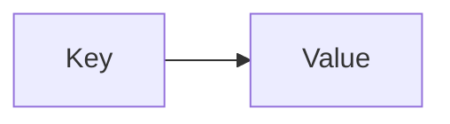
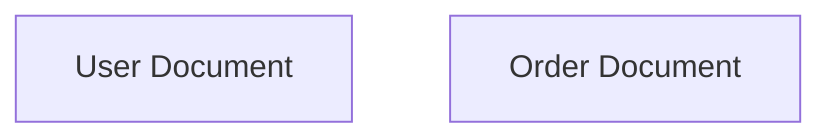
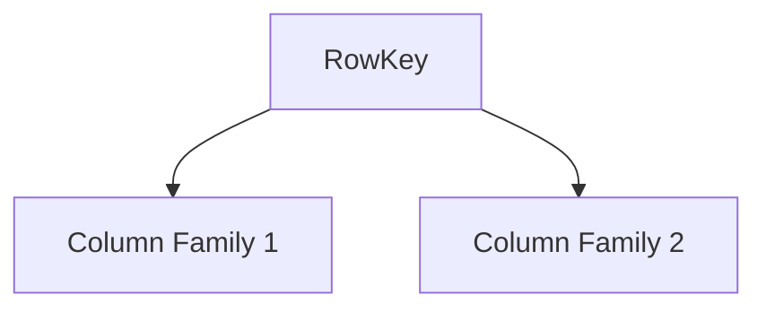
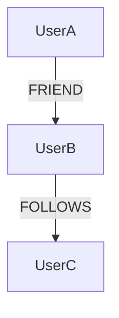
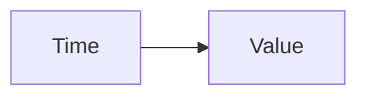
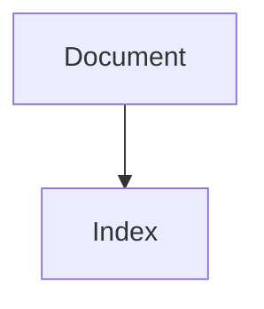
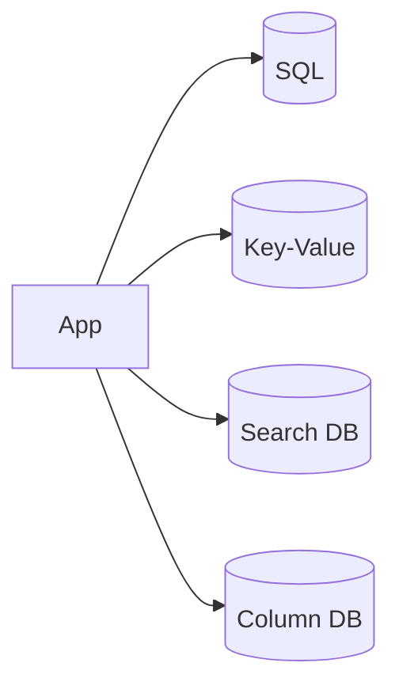

# Types of Databases

> Goal: Learn the major database categories, how they store data, and how to choose the right one during system design.

---

## 3.2.1 Why Database Types Matter

Not all data looks the same.

Different systems need:
- Fast lookups
- Flexible schemas
- Massive write throughput
- Relationship-heavy queries

> Choosing the wrong database type leads to poor performance and scaling issues.

---

## 3.2.2 Relational Databases (RDBMS) ⭐⭐⭐⭐⭐

### Data Model
- Tables (rows & columns)
- Fixed schema
- Relationships via foreign keys

```mermaid
graph TD
    Users -->|user_id| Orders
````

### Characteristics

* ACID transactions
* Strong consistency
* Supports joins
* Schema enforcement

### Use Cases

* Banking systems
* Payment processing
* Order management

### Strengths

* Data integrity
* Complex queries

### Weaknesses

* Harder to scale horizontally
* Schema changes are costly

---

## 3.2.3 Key-Value Databases ⭐⭐⭐⭐

### Data Model

```
key → value
```



### Characteristics

* Extremely fast
* Simple access pattern
* No complex queries

### Use Cases

* Caching
* Session storage
* Rate limiting counters

### Strengths

* Low latency
* Horizontally scalable

### Weaknesses

* Limited querying
* No relationships

---

## 3.2.4 Document Databases ⭐⭐⭐⭐⭐

### Data Model

* JSON-like documents
* Flexible schema



### Characteristics

* Schema flexibility
* Nested data
* Indexing support

### Use Cases

* User profiles
* Content management
* Product catalogs

### Strengths

* Rapid development
* Easy schema evolution

### Weaknesses

* Data duplication
* Limited joins

---

## 3.2.5 Column-Family Databases ⭐⭐⭐⭐

### Data Model

* Data stored by column families
* Optimized for writes



### Characteristics

* High write throughput
* Distributed by design
* Tunable consistency

### Use Cases

* Time-series data
* Logging
* Analytics ingestion

### Strengths

* Massive scalability
* Write-efficient

### Weaknesses

* Complex data modeling
* Limited ad-hoc queries

---

## 3.2.6 Graph Databases ⭐⭐⭐⭐

### Data Model

* Nodes and edges
* Relationship-first design



### Characteristics

* Relationship traversal
* Graph queries
* Schema-light

### Use Cases

* Social networks
* Recommendation engines
* Fraud detection

### Strengths

* Fast relationship queries
* Intuitive modeling

### Weaknesses

* Hard to scale horizontally
* Not ideal for simple CRUD

---

## 3.2.7 Time-Series Databases ⭐⭐⭐

### Data Model

* Time-stamped data points



### Characteristics

* Optimized for time-based queries
* Compression
* Retention policies

### Use Cases

* Metrics
* Monitoring
* IoT data

---

## 3.2.8 Search Databases ⭐⭐⭐

### Data Model

* Inverted indexes
* Full-text search



### Characteristics

* Text search
* Relevance scoring
* Aggregations

### Use Cases

* Search functionality
* Log analysis

---

## 3.2.9 Choosing the Right Database (Interview Framework) ⭐⭐⭐⭐⭐

Ask these questions:

1. Is strong consistency required?
2. Is schema fixed or evolving?
3. Read-heavy or write-heavy?
4. Relationship complexity?
5. Scale requirements?

---

## 3.2.10 Real-World Polyglot Example ⭐⭐⭐⭐⭐



> Real systems use **multiple databases**, each for a specific purpose.

---

## 3.2.11 Common Interview Mistakes ❌

❌ Using one database for everything
❌ Choosing DBs by popularity
❌ Ignoring access patterns

✅ Correct approach:

* Start with requirements
* Choose the simplest DB that works
* Add specialized DBs only when needed

---

## Key Takeaways ⭐⭐⭐⭐⭐

* Different DBs solve different problems
* RDBMS for correctness
* Key-value for speed
* Document DBs for flexibility
* Column DBs for scale
* Graph DBs for relationships
* Polyglot persistence is common

---

## Interview-Ready One-Liners ⭐

* “Database choice depends on access patterns.”
* “Use the simplest database that satisfies requirements.”
* “Real systems use multiple databases.”
* “Relationships drive graph databases.”

---

## References & Deep-Dive Resources

### Articles

* [https://www.geeksforgeeks.org/types-of-databases/](https://www.geeksforgeeks.org/types-of-databases/)
* [https://aws.amazon.com/nosql/](https://aws.amazon.com/nosql/)
* [https://martinfowler.com/articles/nosql-introduction.html](https://martinfowler.com/articles/nosql-introduction.html)

### Videos

* [https://www.youtube.com/watch?v=W2Z7fbCLSTw](https://www.youtube.com/watch?v=W2Z7fbCLSTw) (Database Types Explained)
* [https://www.youtube.com/watch?v=ZS_kXvOeQ5Y](https://www.youtube.com/watch?v=ZS_kXvOeQ5Y) (NoSQL Databases)

### Books

* *Designing Data-Intensive Applications*
* *Database Internals* – Alex Petrov

---