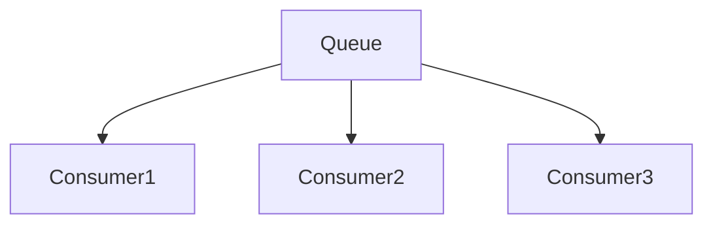
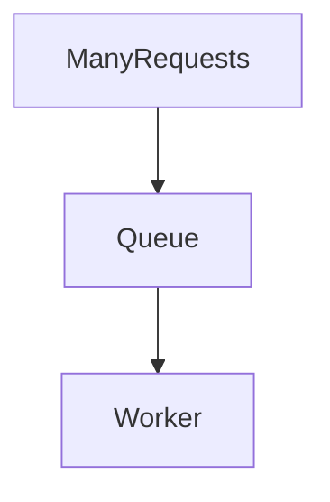
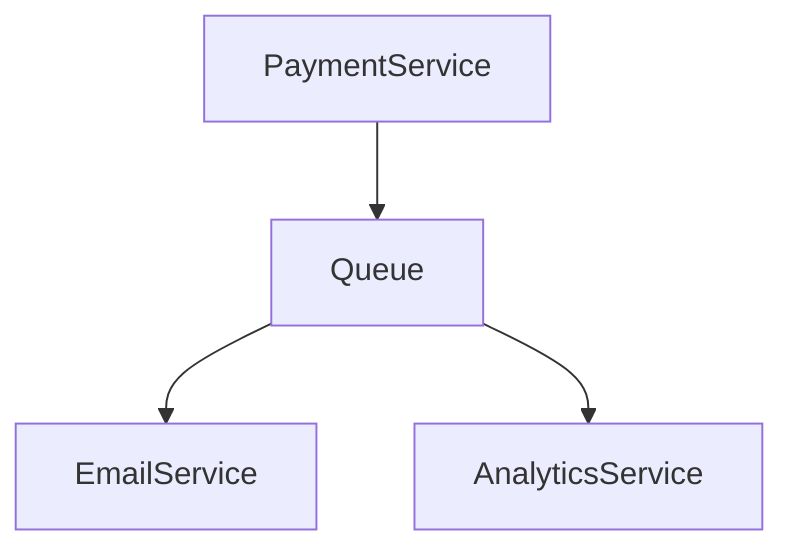

# Message Queues

> Goal: Understand why message queues are used in scalable systems, how producers and consumers interact, and how queues provide durability and ordering guarantees.

---

## 5.2.1 Why Message Queues Are Needed ⭐⭐⭐⭐⭐

Without queues:
- Services are tightly coupled
- Traffic spikes overload systems
- Failures cascade
- Scaling becomes difficult

With queues:
- Services are decoupled
- Traffic is buffered
- Failures are isolated
- System scales horizontally

```mermaid
graph LR
    Producer --> Queue --> Consumer
````

> Message queues decouple services and absorb traffic spikes.

---

## 5.2.2 Core Components

### Producer

Sends messages to the queue.

### Queue (Broker)

Stores messages temporarily.

### Consumer

Reads and processes messages.

---

## 5.2.3 How a Message Queue Works

1. Producer publishes message.
2. Queue stores message.
3. Consumer retrieves message.
4. Consumer acknowledges processing.

```mermaid
sequenceDiagram
    Producer->>Queue: Send message
    Queue-->>Consumer: Deliver message
    Consumer->>Queue: ACK
```

If no ACK:

* Message may be re-delivered.

---

## 5.2.4 Message Durability ⭐⭐⭐⭐

Durability ensures messages:

* Survive crashes
* Are stored persistently (disk)

Without durability:

* Messages may be lost.

> Durable queues are essential for critical systems.

---

## 5.2.5 Ordering Guarantees ⭐⭐⭐⭐

Some queues guarantee:

* FIFO (First In First Out)

Others:

* No strict ordering

Ordering often reduces scalability.

---

## 5.2.6 Scalability with Multiple Consumers ⭐⭐⭐⭐⭐

Multiple consumers can process messages in parallel.



Benefits:

* Increased throughput
* Faster processing

---

## 5.2.7 Handling Traffic Spikes ⭐⭐⭐⭐⭐

If traffic spikes:

* Queue stores excess messages
* Consumers process at steady rate



> Queue acts as a buffer.

---

## 5.2.8 Message Acknowledgment

After processing:

* Consumer sends ACK
* Queue deletes message

If consumer crashes before ACK:

* Message re-delivered

---

## 5.2.9 Dead Letter Queue (DLQ) ⭐⭐⭐⭐

If message fails repeatedly:

* Sent to DLQ
* Used for debugging


---

## 5.2.10 Real-World Example (Payment System)

Flow:

1. Payment processed
2. Event pushed to queue
3. Email service consumes event
4. Analytics updated



> Critical path is sync; side effects use queue.

---

## 5.2.11 Common Interview Mistakes ❌

❌ Using queue for immediate user response
❌ Ignoring idempotency
❌ Not handling retries
❌ Forgetting durability requirements

✅ Correct thinking:

* Use queue for async workflows
* Expect duplicates
* Plan for failures

---

## Key Takeaways ⭐⭐⭐⭐⭐

* Queues decouple services
* Provide buffering and durability
* Support parallel consumers
* Improve scalability
* Require idempotent consumers

---

## Interview-Ready One-Liners ⭐

* “Queues absorb traffic spikes.”
* “Consumers must be idempotent.”
* “Durability ensures messages survive crashes.”
* “Queues improve failure isolation.”