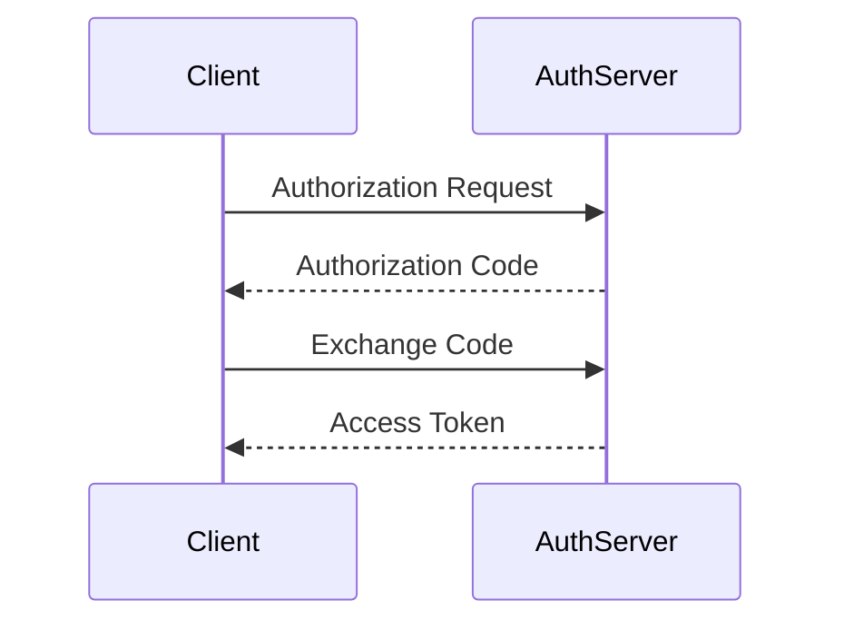

# Authentication & Authorization

> Goal: Understand how systems verify identity (authentication) and control access (authorization), including OAuth and API security best practices.

---

# 8.3.1 Authentication vs Authorization ⭐⭐⭐⭐⭐

## Authentication (AuthN)

Question:
> Who are you?

Verifies identity of user or service.

Examples:
- Username & password
- OTP
- Biometric
- OAuth login

---

## Authorization (AuthZ)

Question:
> What are you allowed to do?

Determines permissions after authentication.

Examples:
- Admin vs regular user
- Read-only vs write access
- Access to specific resources

---

### Key Difference

| Authentication | Authorization |
|---------------|---------------|
| Identity verification | Permission control |
| Happens first | Happens after auth |
| Login step | Access control step |

> AuthN comes before AuthZ.

---

# 8.3.2 Session-Based Authentication ⭐⭐⭐⭐

Traditional web apps:

1. User logs in.
2. Server creates session.
3. Session ID stored in cookie.
4. Server validates session on each request.

Problems:
- Hard to scale
- Server must store session state

---

# 8.3.3 Token-Based Authentication ⭐⭐⭐⭐⭐

Modern systems use tokens (e.g., JWT).

Flow:

1. User logs in.
2. Server generates token.
3. Client stores token.
4. Client sends token with each request.

```mermaid
sequenceDiagram
    Client->>Server: Login
    Server-->>Client: JWT Token
    Client->>Server: API Request + Token
````

Benefits:

* Stateless
* Scalable
* Works well with microservices

---

# 8.3.4 What Is JWT? ⭐⭐⭐⭐

JWT (JSON Web Token):

* Self-contained token
* Contains user info (claims)
* Digitally signed

Structure:

```
Header.Payload.Signature
```

Signature ensures:

* Token not tampered

---

## Important:

JWT should:

* Be signed
* Have expiration time
* Not contain sensitive data

---

# 8.3.5 OAuth (High-Level Flow) ⭐⭐⭐⭐⭐

OAuth allows:

* Third-party apps to access user resources
* Without sharing passwords

Example:
Login with Google.

---

## OAuth Roles

* Resource Owner (User)
* Client (App)
* Authorization Server
* Resource Server

---

## High-Level Flow

1. User redirected to Authorization Server.
2. User logs in.
3. App receives authorization code.
4. App exchanges code for access token.
5. Access token used for API calls.



---

# 8.3.6 Access Token vs Refresh Token ⭐⭐⭐⭐

## Access Token

* Short-lived
* Used for API access

## Refresh Token

* Long-lived
* Used to obtain new access token

Improves security by limiting exposure.

---

# 8.3.7 Role-Based Access Control (RBAC) ⭐⭐⭐⭐

Access controlled based on roles.

Example:

* Admin
* User
* Support

Simple and scalable.

---

# 8.3.8 API Security Best Practices ⭐⭐⭐⭐⭐

* Always use HTTPS
* Validate tokens on every request
* Implement rate limiting
* Apply least privilege
* Use short token expiry
* Protect against replay attacks
* Log suspicious activity

---

# 8.3.9 Common Vulnerabilities

* Storing tokens in localStorage (XSS risk)
* Not validating JWT signature
* Long-lived tokens without rotation
* Hardcoding secrets
* Weak password hashing

---

# 8.3.10 Authentication in Payment System

Critical:

* Multi-factor authentication (MFA)
* Short token expiry
* Strong password hashing
* Role-based permissions
* Audit logs

Never:

* Trust client-side validation
* Expose secrets in frontend

---

# Key Takeaways ⭐⭐⭐⭐⭐

* Authentication verifies identity
* Authorization controls permissions
* JWT enables stateless authentication
* OAuth enables third-party access
* Apply strict API security practices

---

# Interview-Ready One-Liners ⭐

* “Authentication answers who; authorization answers what.”
* “JWT enables stateless authentication.”
* “OAuth avoids sharing passwords.”
* “Always validate tokens server-side.”