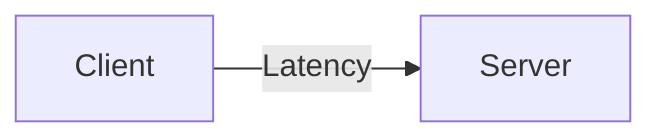
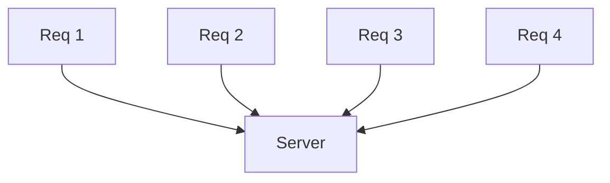
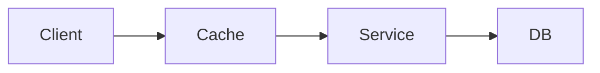
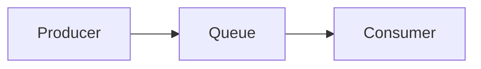
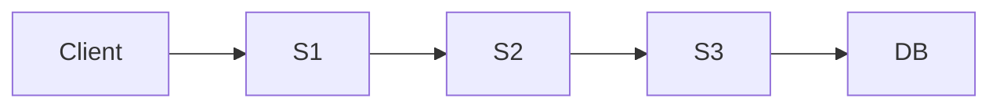

# MODULE 1.3: Latency vs Throughput ⭐⭐⭐⭐

> Goal: Understand the difference between latency and throughput, why systems optimize for one over the other, and how design choices affect both.

---

## 1.3.1 Definitions (Start Here)

### Latency
- **Time taken to process a single request**
- Measured in milliseconds (ms)

Example:
```

Request → Response = 120 ms

```

---

### Throughput
- **Number of requests processed per unit time**
- Measured in RPS / QPS (requests per second)

Example:
```

System handles 5,000 requests/second

````

---

## 1.3.2 Simple Analogy (Interview-Friendly)

### Toll Booth Example 🚗

- **Latency** → Time for one car to pass the booth
- **Throughput** → Cars passing per minute

```text
Low latency ≠ High throughput
High throughput ≠ Low latency
````

This analogy works GREAT in interviews.

---

## 1.3.3 Visual Difference





* First diagram → **Latency**
* Second diagram → **Throughput**

---

## 1.3.4 Why This Distinction Matters in System Design

Different systems optimize for different goals.

| System Type       | Priority          |
| ----------------- | ----------------- |
| Payment systems   | Low latency       |
| Trading systems   | Ultra-low latency |
| Analytics systems | High throughput   |
| Logging systems   | High throughput   |
| Video streaming   | Balanced          |

---

## 1.3.5 Low Latency Systems ⭐⭐⭐⭐

### Characteristics

* Fast response required
* User-facing
* Often synchronous

### Examples

* Payment authorization
* Login APIs
* Search suggestions

### Design Choices

* In-memory caching
* Fewer network hops
* Strong consistency (often)



> Cache reduces latency by avoiding DB calls.

---

## 1.3.6 High Throughput Systems ⭐⭐⭐⭐

### Characteristics

* Process massive data
* Latency less critical
* Often asynchronous

### Examples

* Log ingestion
* Analytics pipelines
* Event processing

### Design Choices

* Message queues
* Batch processing
* Eventual consistency



> Queue absorbs traffic spikes and increases throughput.

---

## 1.3.7 Can a System Optimize for Both?

### Short Answer

**Rarely, and at a cost.**

### Reality

* Optimizing latency often reduces throughput
* Optimizing throughput often increases latency

This is a **classic system design trade-off**.

---

## 1.3.8 Design Choices That Affect Latency

| Design Choice     | Impact           |
| ----------------- | ---------------- |
| Network hops      | Increase latency |
| Synchronous calls | Increase latency |
| Disk I/O          | High latency     |
| Caching           | Reduces latency  |
| Serialization     | Adds latency     |

---

## 1.3.9 Design Choices That Affect Throughput

| Design Choice           | Impact                |
| ----------------------- | --------------------- |
| Asynchronous processing | Increases throughput  |
| Batching                | Increases throughput  |
| Parallelism             | Increases throughput  |
| Backpressure            | Stabilizes throughput |

---

## 1.3.10 Tail Latency (IMPORTANT INTERVIEW TOPIC) ⭐⭐⭐⭐

### What is Tail Latency?

Latency experienced by the **slowest requests** (p95, p99).

Example:

```
Average latency = 100 ms
p99 latency = 2 seconds
```

### Why It Matters

* Users remember slow requests
* SLAs often defined on p95/p99

### Interview Line ⭐

> Tail latency matters more than average latency.

---

## 1.3.11 Latency vs Throughput in Microservices



Each hop:

* Adds latency
* Reduces reliability

### System Design Insight ⭐

> Microservices increase throughput scalability but can increase latency.

---

## 1.3.12 Real Example: Payment vs Analytics

### Payment System

* User waiting
* Must respond fast
* Strong consistency

👉 Optimize for **latency**

---

### Analytics System

* Batch processing
* User not waiting
* Eventual consistency acceptable

👉 Optimize for **throughput**

---

## 1.3.13 Common Interview Mistakes ❌

❌ Saying “high throughput means low latency”
❌ Ignoring tail latency
❌ Not relating to use cases

✅ Always ask:

> “Is this system latency-sensitive or throughput-oriented?”

---

## Key Takeaways ⭐⭐⭐⭐⭐

* Latency = time per request
* Throughput = requests per second
* You usually optimize for one
* Tail latency matters most
* System requirements decide priorities

---

## Interview-Ready One-Liners ⭐

* “Latency and throughput are different metrics.”
* “Optimizing one often hurts the other.”
* “Tail latency matters more than average.”
* “This system is throughput-oriented, not latency-sensitive.”

---

## References & Deep-Dive Resources

### Articles

* [https://www.cloudflare.com/learning/performance/glossary/what-is-latency/](https://www.cloudflare.com/learning/performance/glossary/what-is-latency/)
* [https://aws.amazon.com/what-is/latency/](https://aws.amazon.com/what-is/latency/)
* [https://www.geeksforgeeks.org/difference-between-throughput-and-latency/](https://www.geeksforgeeks.org/difference-between-throughput-and-latency/)

### Videos

* [https://www.youtube.com/watch?v=Z1U3hZx7F7I](https://www.youtube.com/watch?v=Z1U3hZx7F7I) (Latency vs Throughput)
* [https://www.youtube.com/watch?v=K2p1N4h6f7k](https://www.youtube.com/watch?v=K2p1N4h6f7k) (Tail Latency Explained)

### Books

* *Designing Data-Intensive Applications*
* *Site Reliability Engineering* – Google

---
