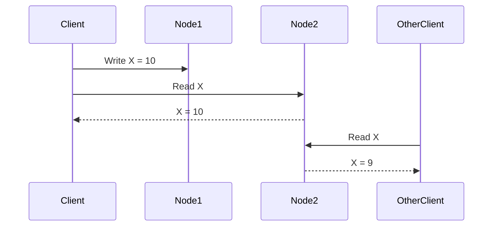
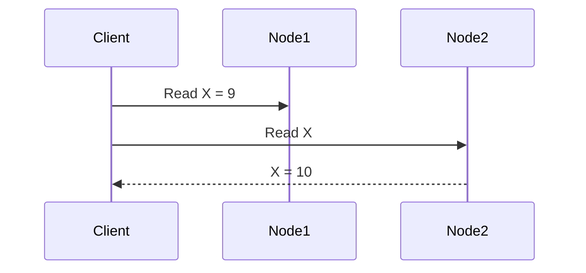
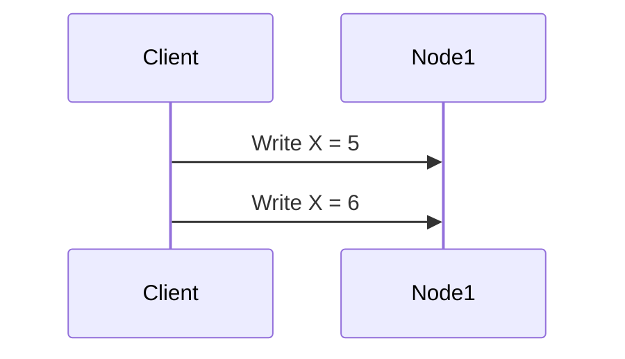
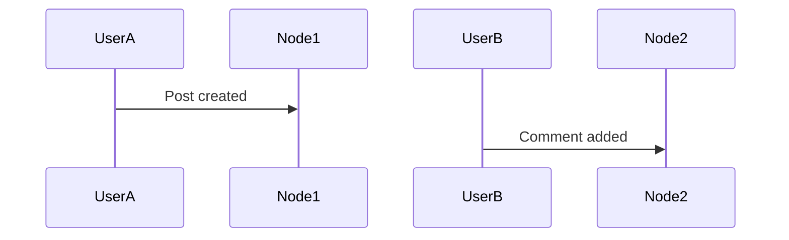

# Consistency Models

> Goal: Understand how and when data becomes consistent in distributed systems, and how different consistency models affect correctness, latency, and availability.

---

## 1.5.1 What Is Consistency?

**Consistency** defines the **rules for what data a client is allowed to see** after writes occur in a distributed system.

It answers questions like:
- Will I see my own update immediately?
- Will all users see the same value?
- Can different users see different values at the same time?

---

## 1.5.2 Why Consistency Models Matter

In distributed systems:
- Data is replicated
- Network delays exist
- Failures happen

👉 Because of this, **perfect consistency is expensive**.

Consistency models let us **choose the right trade-off** between:
- Correctness
- Latency
- Availability

---

## 1.5.3 Strong Consistency ⭐⭐⭐⭐⭐

### Definition
After a write completes, **all subsequent reads return the latest value**.

```mermaid
sequenceDiagram
    Client->>Node1: Write X = 10
    Client->>Node2: Read X
    Node2-->>Client: X = 10
````

### Characteristics

* Always correct data
* High coordination cost
* Higher latency
* Lower availability during failures

### Use Cases

* Banking systems
* Payment ledgers
* Inventory management

### Interview Line ⭐

> Strong consistency prioritizes correctness over latency.

---

## 1.5.4 Eventual Consistency ⭐⭐⭐⭐⭐

### Definition

If no new updates occur, **all replicas will eventually converge** to the same value.

```mermaid
sequenceDiagram
    Client->>Node1: Write X = 10
    Client->>Node2: Read X
    Node2-->>Client: X = 9
    Note over Node2: Eventually updates to 10
```

### Characteristics

* High availability
* Lower latency
* Temporary inconsistencies allowed

### Use Cases

* Social media feeds
* Likes/comments count
* Caches

### Interview Line ⭐

> Eventual consistency trades correctness for availability and speed.

---

## 1.5.5 Read-After-Write Consistency ⭐⭐⭐⭐

### Definition

A client always sees **its own writes**, but others may not see them immediately.



### Characteristics

* Better user experience
* Moderate consistency
* Common in user-facing apps

### Use Cases

* User profile updates
* Settings changes

---

## 1.5.6 Monotonic Read Consistency ⭐⭐⭐

### Definition

Once a client has seen a value, it will **never see an older value** later.



❌ Never allowed:

```
9 → 10 → 8
```

### Use Cases

* News feeds
* Timeline scrolling

---

## 1.5.7 Monotonic Write Consistency ⭐⭐⭐

### Definition

Writes from a single client are **applied in order**.



Guarantee:

```
X = 6 (never X = 5 after)
```

### Use Cases

* Financial transactions
* User updates

---

## 1.5.8 Causal Consistency ⭐⭐⭐⭐

### Definition

Operations that are **causally related** must be seen in the same order by all nodes.

Example:

* Comment must appear **after** the post



Guarantee:

* No one sees comment before post

### Use Cases

* Social networks
* Collaboration tools

---

## 1.5.9 Consistency Spectrum (Important View)


👉 As consistency increases:

* Latency increases
* Availability decreases

---

## 1.5.10 Choosing the Right Consistency Model

| System         | Consistency Model |
| -------------- | ----------------- |
| Payment ledger | Strong            |
| Bank balance   | Strong            |
| Social feed    | Eventual          |
| User profile   | Read-after-write  |
| Cache          | Eventual          |

### Interview Rule ⭐

> Choose the weakest consistency model that satisfies business requirements.

---

## 1.5.11 Consistency vs CAP (Connection)

* CP systems → Strong consistency
* AP systems → Eventual consistency
* Hybrid systems → Mixed models

> Consistency models are **how CAP decisions are implemented**.

---

## 1.5.12 Common Interview Mistakes ❌

❌ Thinking eventual consistency means “wrong data forever”
❌ Using strong consistency everywhere
❌ Ignoring user experience

✅ Reality:

* Eventual consistency is safe for many systems
* Strong consistency is expensive
* Hybrid models are common

---

## Key Takeaways ⭐⭐⭐⭐⭐

* Consistency defines what data users see
* Strong consistency = correctness + latency
* Eventual consistency = availability + speed
* Many useful middle-ground models exist
* Choose based on business needs

---

## Interview-Ready One-Liners ⭐

* “Consistency defines data visibility guarantees.”
* “Strong consistency is expensive.”
* “Eventual consistency is acceptable for many user-facing systems.”
* “Hybrid consistency models are common in real systems.”

---

## References & Deep-Dive Resources

### Articles

* [https://www.geeksforgeeks.org/consistency-models-in-distributed-systems/](https://www.geeksforgeeks.org/consistency-models-in-distributed-systems/)
* [https://martinfowler.com/articles/patterns-of-distributed-systems/](https://martinfowler.com/articles/patterns-of-distributed-systems/)
* [https://jepsen.io/consistency](https://jepsen.io/consistency)

### Videos

* [https://www.youtube.com/watch?v=gluIh8zd26I](https://www.youtube.com/watch?v=gluIh8zd26I) (Consistency Models Explained)
* [https://www.youtube.com/watch?v=ZKXK3x8E3eI](https://www.youtube.com/watch?v=ZKXK3x8E3eI) (Strong vs Eventual Consistency)

### Books

* *Designing Data-Intensive Applications* – Martin Kleppmann
* *Distributed Systems* – Tanenbaum

---