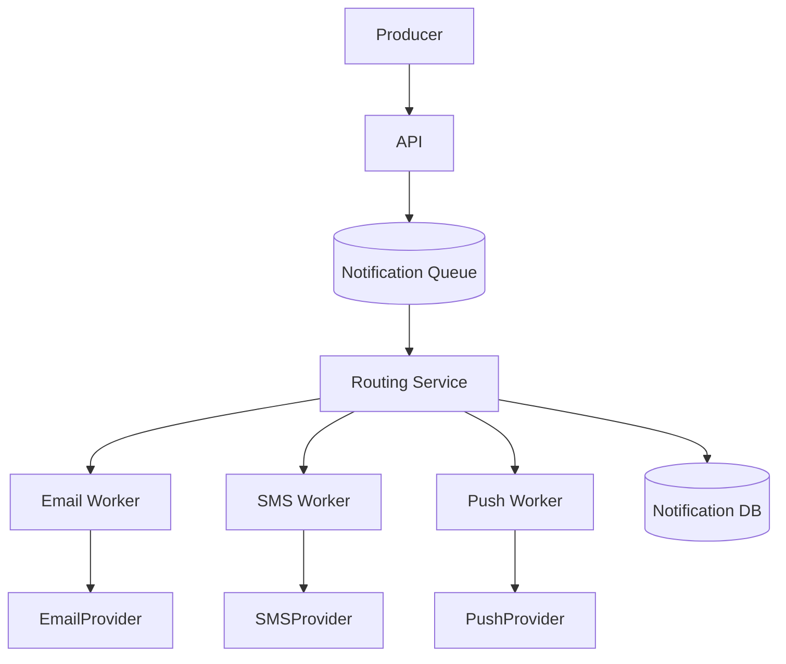

# Notification System Design

> Goal: Build a reliable service to deliver notifications across multiple channels with user preferences and retries.

---

## 10.3.1 Requirements

### Functional
- Send notifications via email/SMS/push
- Template management
- User notification preferences
- Delivery status tracking
- Scheduled notifications

### Non-Functional
- High throughput
- At-least-once delivery
- Channel isolation (one channel failure should not break all)
- Cost-aware routing

---

## 10.3.2 High-Level Architecture

---

## 10.3.3 Data Model

Table `notifications`
- `id` (PK)
- `user_id`
- `channel`
- `template_id`
- `payload` (json)
- `status` (`QUEUED/SENT/FAILED`)
- `scheduled_at`

Table `user_preferences`
- `user_id` (PK)
- `email_enabled`
- `sms_enabled`
- `push_enabled`
- `quiet_hours`

---

## 10.3.4 Processing Flow

1. Producer sends request.
2. Validate payload and preferences.
3. Enqueue job.
4. Worker picks job and calls provider.
5. Update status and retry on transient failure.

---

## 10.3.5 Reliability & Delivery

- Retries with exponential backoff
- DLQ for repeatedly failed jobs
- Idempotency key on send requests
- Provider failover (primary/secondary)
- Circuit breaker around provider APIs

---

## 10.3.6 Scaling Strategies

- Partition queue by channel/tenant
- Autoscale workers by queue lag
- Batch sends where provider supports it
- Cache templates and preferences

---

## 10.3.7 Observability

Track:
- Queue depth
- Send success rate by channel
- Provider latency/error rate
- Retry count and DLQ rate

---

## 10.3.8 Common Interview Mistakes ❌

❌ Synchronous notification sending from user request path
❌ No user preference checks
❌ No DLQ/retry strategy
❌ Mixing template rendering with provider adapters tightly
