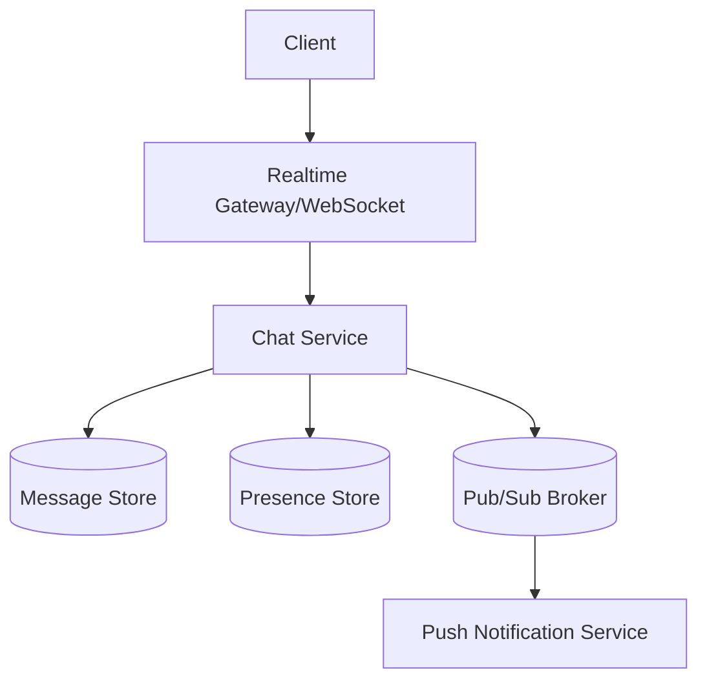

# Chat / Messaging System Design

> Goal: Design a WhatsApp/Slack-like messaging system with low latency, online delivery, and durable message history.

---

## 10.5.1 Requirements

### Functional
- 1:1 and group messaging
- Real-time delivery for online users
- Offline message sync
- Read receipts and typing indicators
- Message history

### Non-Functional
- Low latency
- High fanout capability
- Ordered messages per conversation
- High availability

---

## 10.5.2 High-Level Architecture

---

## 10.5.3 Connection & Delivery Model

- WebSocket for bidirectional real-time communication
- Long polling fallback for constrained environments
- Persist message before acking sender
- Deliver to online recipients immediately
- Queue for offline recipients

---

## 10.5.4 Data Model

Table `conversations`
- `conversation_id` (PK)
- `type` (`DIRECT/GROUP`)
- `created_at`

Table `messages`
- `message_id` (PK)
- `conversation_id` (index)
- `sender_id`
- `seq_no` (per conversation)
- `content`
- `created_at`

Table `conversation_members`
- `conversation_id`
- `user_id`

---

## 10.5.5 Ordering and Reliability

- Sequence numbers per conversation
- At-least-once delivery with client dedup
- Message ACK from recipient/client
- Retry undelivered messages

---

## 10.5.6 Scaling Strategies

- Partition conversations by `conversation_id`
- Sticky sessions for connection gateways
- Separate presence, messaging, and push services
- Fanout workers for large groups

---

## 10.5.7 Presence and Read Receipts

- Presence in Redis with TTL heartbeats
- Read receipts as lightweight events
- Typing indicators as ephemeral events (not persisted long-term)

---

## 10.5.8 Failure Scenarios

- Gateway node crash: client reconnects and resyncs from last message ID
- Duplicate delivery: deduplicate by `message_id`
- Out-of-order arrival: reorder using `seq_no`

---

## 10.5.9 Common Interview Mistakes ❌

❌ No persistent storage before ACK
❌ Ignoring offline users
❌ Assuming exactly-once delivery in distributed network
❌ Not planning group fanout separately
