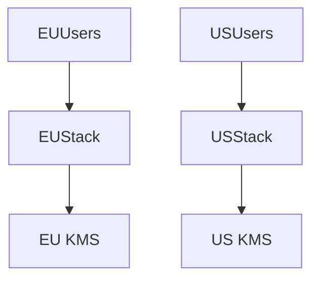

# Data Sovereignty

> Goal: Understand how regional laws shape storage, processing, and access design.

---
## 12.4.1 Core Concepts

- Data residency boundaries
- PII localization
- Regional encryption/key ownership
- Cross-border access controls and auditing

---
## 12.4.2 Architecture Overview

---
## 12.4.3 Detailed Explanation

This topic is important in real-world system design because it directly affects reliability, latency, and operational complexity.

Use this as an interview and production checklist:
- Define goals and constraints first
- Choose patterns based on trade-offs
- Add observability and failure handling from day one
- Validate with load/failure tests

---
## 12.4.4 Failure Scenarios and Trade-offs

- Network failures and retries can cause duplicate work if idempotency is missing
- Cross-component coupling increases blast radius
- Operational complexity grows with scale; automate runbooks and alerts
- Correctness vs latency trade-offs must be explicit and documented

---
## 12.4.5 Common Interview Mistakes ❌

❌ Giving definitions without architecture flow
❌ Ignoring failure modes and recovery plans
❌ Not discussing metrics/SLIs for the design
❌ Missing cost and operational trade-offs
