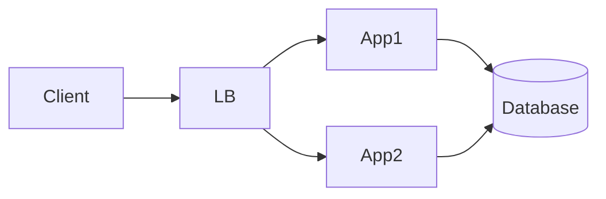
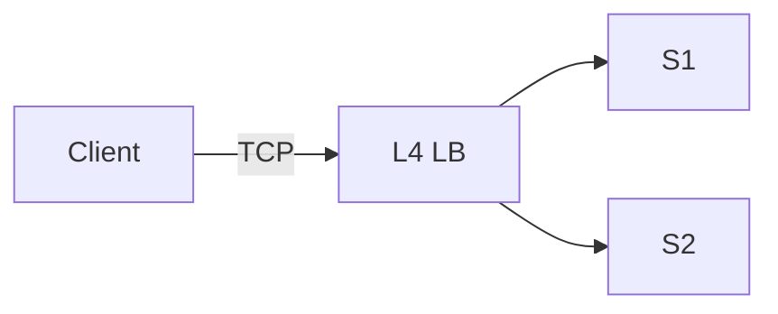
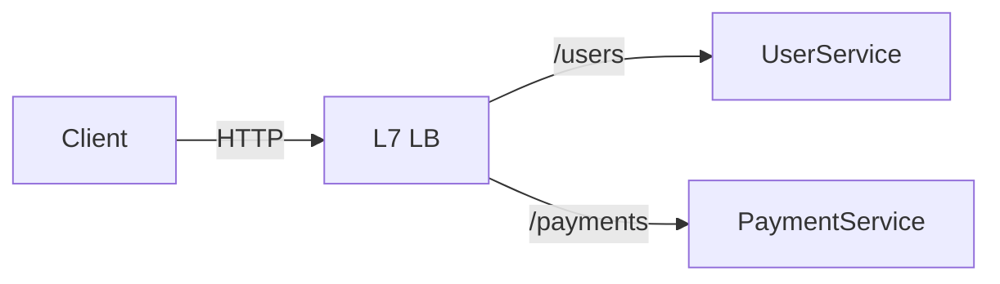
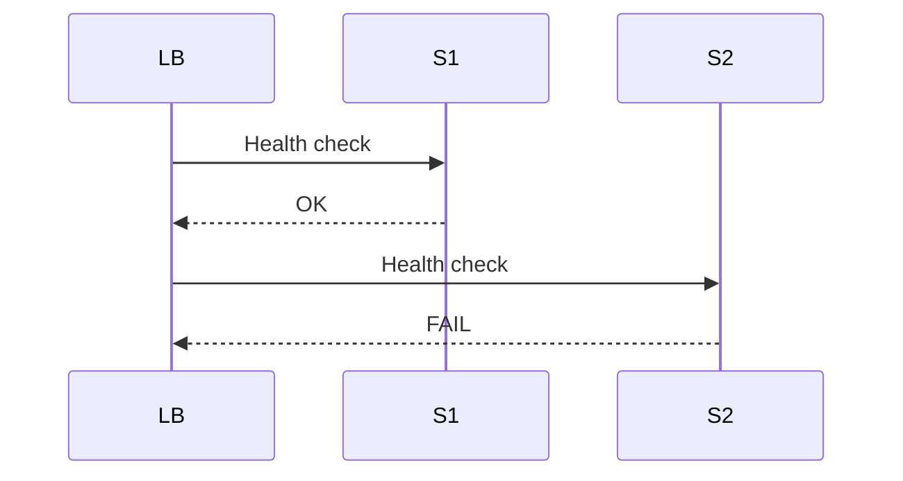
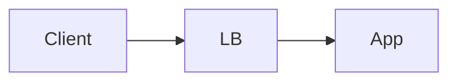
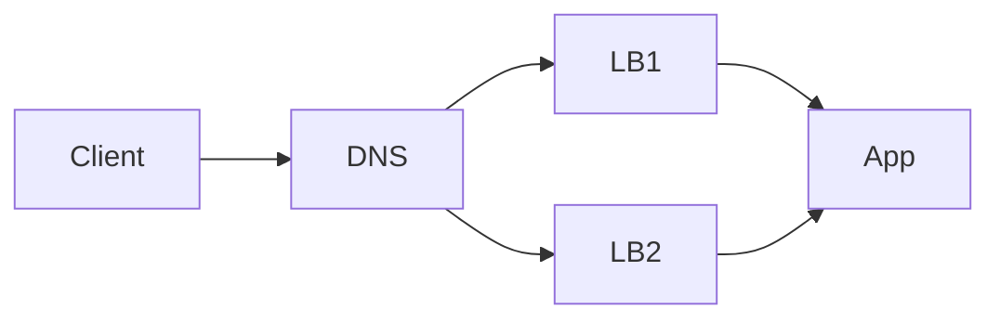
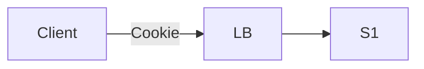
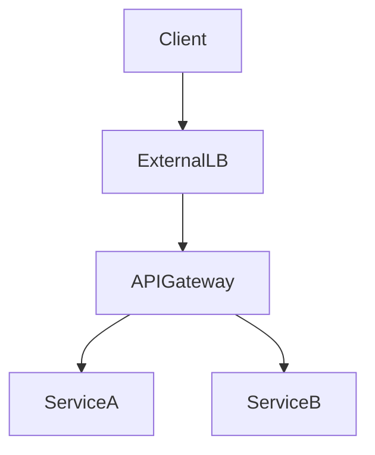

# Load Balancers

> Goal: Understand why load balancers are essential, how they work, and how they enable scalability, availability, and fault tolerance.

---

## 2.1.1 What Is a Load Balancer?

A **load balancer (LB)** is a component that:
- Receives incoming client requests
- Distributes them across multiple backend servers
- Prevents any single server from being overloaded

```mermaid
graph LR
    Client --> LB[Load Balancer]
    LB --> S1[Server 1]
    LB --> S2[Server 2]
    LB --> S3[Server 3]
````

> Without a load balancer, horizontal scaling is not possible.

---

## 2.1.2 Why Do We Need Load Balancers?

### Problems Without a Load Balancer

* Single server overload
* Single Point of Failure (SPOF)
* Poor scalability

```mermaid
graph LR
    Client --> S1[Single Server]
```

If `S1` fails → **system down** ❌

---

### Benefits of Load Balancers ⭐⭐⭐⭐⭐

* Distribute traffic evenly
* Improve availability
* Enable horizontal scaling
* Hide backend complexity from clients

---

## 2.1.3 Load Balancer Responsibilities

A load balancer typically handles:

* Request routing
* Health checks
* Failover
* SSL termination (sometimes)
* Rate limiting (sometimes)

---

## 2.1.4 Where Does a Load Balancer Sit?

### Typical Placement



Clients **never talk directly** to backend servers.

---

## 2.1.5 Layer 4 vs Layer 7 Load Balancers ⭐⭐⭐⭐⭐

---

### Layer 4 Load Balancer (Transport Layer)

Works at:

* TCP / UDP level

Routing based on:

* IP address
* Port



#### Characteristics

* Very fast
* No understanding of HTTP
* Limited routing logic

#### Use Cases

* Simple traffic distribution
* High performance needs

---

### Layer 7 Load Balancer (Application Layer)

Works at:

* HTTP / HTTPS level

Routing based on:

* URL path
* Headers
* Cookies



#### Characteristics

* Smarter routing
* Slightly more latency
* Very flexible

#### Use Cases

* API gateways
* Microservices routing

---

## 2.1.6 Load Balancing Algorithms ⭐⭐⭐⭐

---

### 1. Round Robin

* Requests distributed sequentially

```text
S1 → S2 → S3 → S1 → S2
```

✔ Simple
❌ Ignores server load

---

### 2. Least Connections

* Sends traffic to server with fewest active connections

✔ Better load distribution
❌ Slight overhead

---

### 3. Hash-Based Routing

* Hash of client IP or request key

✔ Session affinity
❌ Uneven distribution possible

---

### Interview Tip ⭐

> Algorithm choice depends on traffic pattern and statefulness.

---

## 2.1.7 Health Checks ⭐⭐⭐⭐⭐

### What Are Health Checks?

Load balancer periodically checks backend server health.



### Why Important

* Automatically removes unhealthy servers
* Prevents failed requests

---

## 2.1.8 Load Balancer as a Single Point of Failure?

### Problem

If there is only **one load balancer**, it becomes a SPOF.



---

### Solution: Multiple Load Balancers



✔ High availability
✔ Fault tolerance

---

## 2.1.9 Stateless Services & Load Balancers

Load balancers work best when backend services are **stateless**.

Why?

* Any request can go to any server
* No session stickiness required

### If Services Are Stateful

* Sticky sessions needed
* Harder to scale

---

## 2.1.10 Sticky Sessions (Session Affinity)

### What Are Sticky Sessions?

Requests from a client always go to the same server.



### Problems

* Uneven load
* Reduced fault tolerance

### System Design Rule ⭐

> Avoid sticky sessions whenever possible.

---

## 2.1.11 Load Balancers in Microservices

In modern systems:

* External LB → entry point
* Internal LB / API gateway → service routing



---

## Key Takeaways ⭐⭐⭐⭐⭐

* Load balancers enable horizontal scaling
* L4 = fast, simple
* L7 = smart, flexible
* Health checks are critical
* Avoid single load balancer SPOF
* Stateless services work best

---

## Interview-Ready One-Liners ⭐

* “Load balancers distribute traffic and remove SPOFs.”
* “Layer 7 load balancers enable smart routing.”
* “Health checks prevent routing to failed servers.”
* “Stateless services scale best behind load balancers.”

---

## References & Deep-Dive Resources

### Articles

* [https://www.cloudflare.com/learning/performance/what-is-load-balancing/](https://www.cloudflare.com/learning/performance/what-is-load-balancing/)
* [https://www.nginx.com/resources/glossary/load-balancing/](https://www.nginx.com/resources/glossary/load-balancing/)
* [https://aws.amazon.com/what-is/load-balancing/](https://aws.amazon.com/what-is/load-balancing/)

### Videos

* [https://www.youtube.com/watch?v=Kx3x4k6U8V8](https://www.youtube.com/watch?v=Kx3x4k6U8V8) (Load Balancing Explained)
* [https://www.youtube.com/watch?v=QKZ1vZ1rYpQ](https://www.youtube.com/watch?v=QKZ1vZ1rYpQ) (L4 vs L7)

### Books

* *Designing Data-Intensive Applications*
* *System Design Interview* – Alex Xu

---