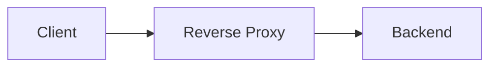
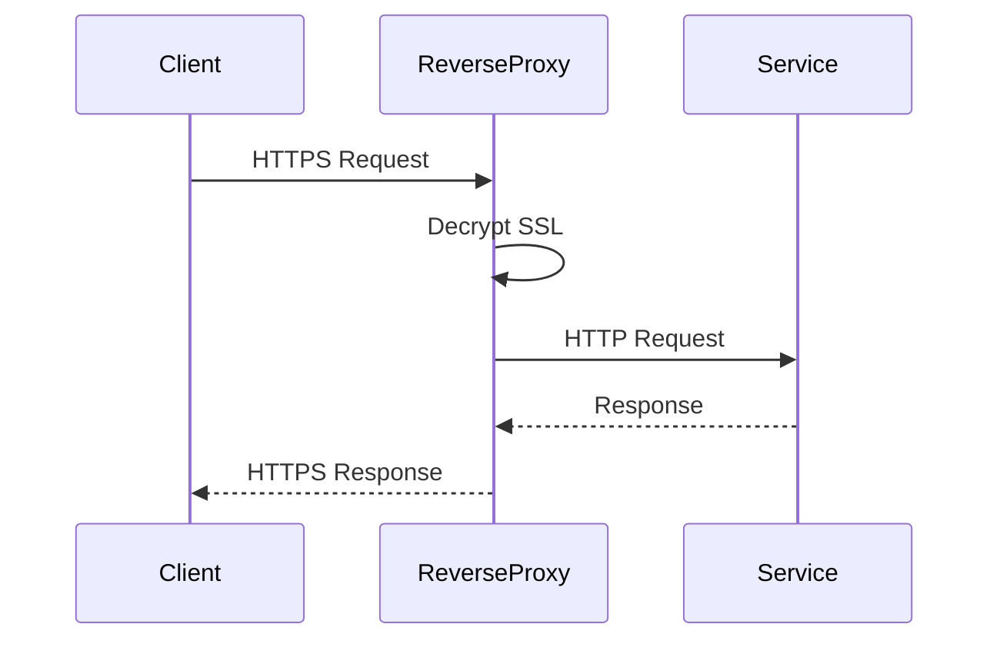
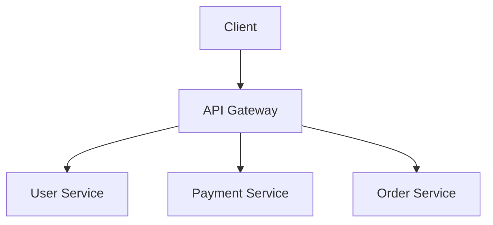
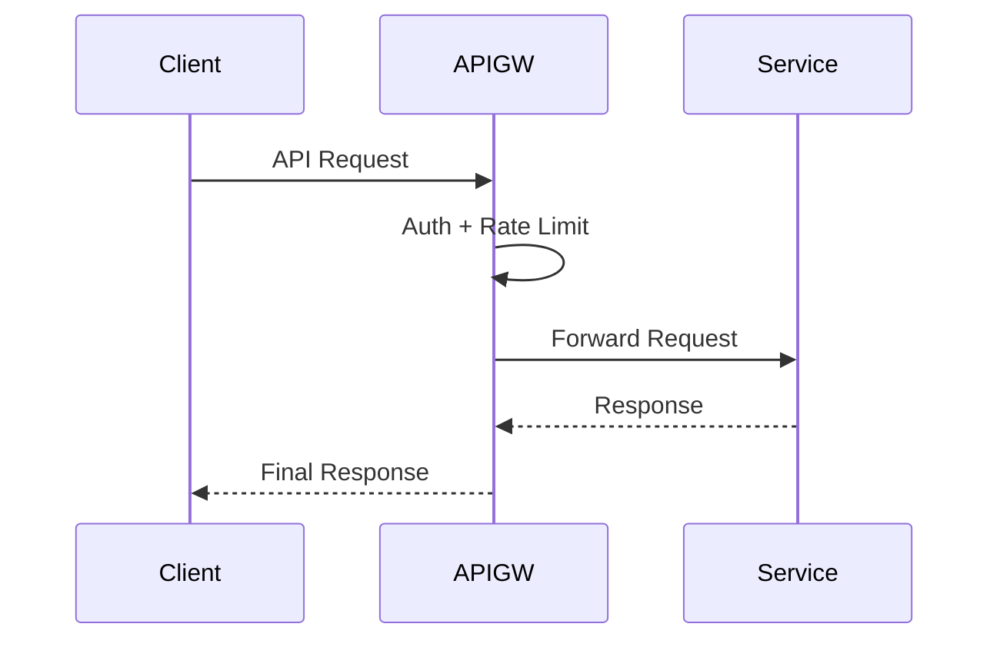
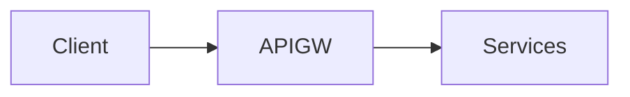
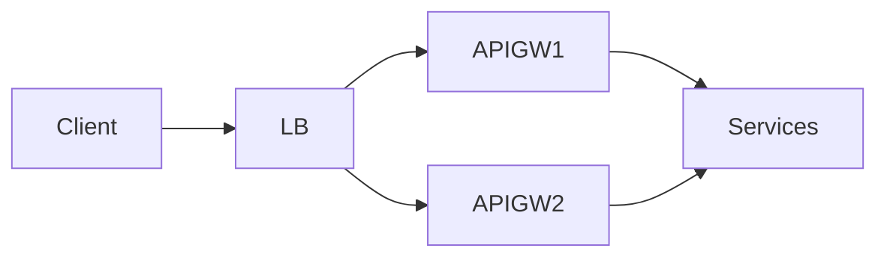
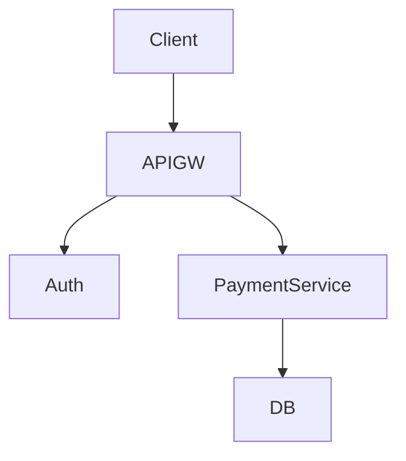

# Reverse Proxy & API Gateway

> Goal: Understand how reverse proxies and API gateways sit in front of services, what problems they solve, and how they differ in modern system design.

---

## 2.2.1 What Is a Reverse Proxy?

A **reverse proxy** is a server that:
- Sits **in front of backend servers**
- Receives client requests
- Forwards them to appropriate backend services
- Returns responses to clients

```mermaid
graph LR
    Client --> RP[Reverse Proxy]
    RP --> S1[App Server 1]
    RP --> S2[App Server 2]
````

> Clients never directly communicate with backend servers.

---

## 2.2.2 Reverse Proxy vs Forward Proxy

### Forward Proxy

* Sits in front of **clients**
* Used by clients to access the internet

### Reverse Proxy

* Sits in front of **servers**
* Used by servers to control access

```mermaid
graph LR
    Client --> FP[Forward Proxy] --> Internet
```



---

## 2.2.3 Why Use a Reverse Proxy?

### Core Benefits ⭐⭐⭐⭐

* Hides backend servers
* Improves security
* Centralizes routing
* Enables SSL termination
* Enables caching

---

## 2.2.4 Common Responsibilities of a Reverse Proxy

A reverse proxy often handles:

* Request routing
* SSL termination
* Basic load balancing
* Caching
* Compression
* Security headers



---

## 2.2.5 Reverse Proxy vs Load Balancer

| Aspect          | Reverse Proxy    | Load Balancer        |
| --------------- | ---------------- | -------------------- |
| Primary role    | Request handling | Traffic distribution |
| Routing logic   | URL-based        | Algorithm-based      |
| SSL termination | Yes              | Sometimes            |
| Smart routing   | Yes              | Limited              |

> In practice, many tools act as **both**.

---

## 2.2.6 What Is an API Gateway? ⭐⭐⭐⭐⭐

An **API Gateway** is a specialized reverse proxy designed for **APIs and microservices**.

It acts as:

* Single entry point for all APIs
* Policy enforcement layer



---

## 2.2.7 Why API Gateways Exist

Microservices introduce problems:

* Too many services exposed
* Cross-cutting concerns duplicated
* Security inconsistencies

API Gateway centralizes:

* Authentication
* Authorization
* Rate limiting
* Logging
* Routing

---

## 2.2.8 Key Responsibilities of an API Gateway ⭐⭐⭐⭐⭐

### Core Features

* Request routing
* Authentication & authorization
* Rate limiting
* Request/response transformation
* Aggregation
* Monitoring



---

## 2.2.9 API Gateway vs Reverse Proxy

| Aspect                | Reverse Proxy        | API Gateway  |
| --------------------- | -------------------- | ------------ |
| Scope                 | General HTTP traffic | API-focused  |
| Auth & rate limiting  | Limited              | Core feature |
| Request aggregation   | No                   | Yes          |
| Microservices support | Basic                | Strong       |

### Interview Line ⭐

> An API Gateway is a specialized reverse proxy for APIs.

---

## 2.2.10 API Gateway vs Load Balancer

| Aspect         | API Gateway      | Load Balancer        |
| -------------- | ---------------- | -------------------- |
| Purpose        | Policy + routing | Traffic distribution |
| Auth           | Yes              | No                   |
| Rate limiting  | Yes              | No                   |
| Business-aware | Yes              | No                   |

> Load balancers care about **servers**; API gateways care about **requests**.

---

## 2.2.11 Single API Gateway Problem (SPOF)

### Problem

A single API Gateway can become:

* Bottleneck
* Single Point of Failure



---

### Solution

* Multiple API Gateway instances
* Load balancer in front



---

## 2.2.12 API Gateway in a Payment System (Example)

### Flow

1. Client sends payment request
2. API Gateway authenticates
3. Rate limit checked
4. Routed to payment service



---

## 2.2.13 When NOT to Use an API Gateway

Avoid API Gateway when:

* Simple monolith
* Very low traffic
* No cross-cutting concerns

> Start simple, add gateway when needed.

---

## 2.2.14 Common Interview Mistakes ❌

❌ Confusing load balancer with API gateway
❌ Saying API gateway replaces load balancer
❌ Ignoring SPOF risk

✅ Correct thinking:

* They solve **different problems**
* Often used **together**

---

## Key Takeaways ⭐⭐⭐⭐⭐

* Reverse proxy sits in front of servers
* API Gateway is a specialized reverse proxy
* Load balancer distributes traffic
* API Gateway enforces policies
* Gateways must be highly available

---

## Interview-Ready One-Liners ⭐

* “An API Gateway is a specialized reverse proxy.”
* “Load balancers distribute traffic; gateways enforce policies.”
* “Gateways centralize cross-cutting concerns.”
* “Gateways must be horizontally scalable.”

---

## References & Deep-Dive Resources

### Articles

* [https://www.cloudflare.com/learning/cdn/glossary/reverse-proxy/](https://www.cloudflare.com/learning/cdn/glossary/reverse-proxy/)
* [https://www.nginx.com/resources/glossary/api-gateway/](https://www.nginx.com/resources/glossary/api-gateway/)
* [https://microservices.io/patterns/apigateway.html](https://microservices.io/patterns/apigateway.html)

### Videos

* [https://www.youtube.com/watch?v=Z0vG7FZ0x3A](https://www.youtube.com/watch?v=Z0vG7FZ0x3A) (Reverse Proxy Explained)
* [https://www.youtube.com/watch?v=6dJ5rWgY5JY](https://www.youtube.com/watch?v=6dJ5rWgY5JY) (API Gateway Explained)

### Books

* *Building Microservices* – Sam Newman
* *Designing Data-Intensive Applications*

---