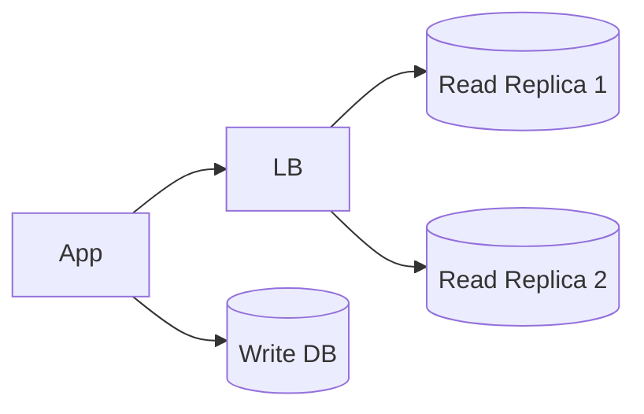
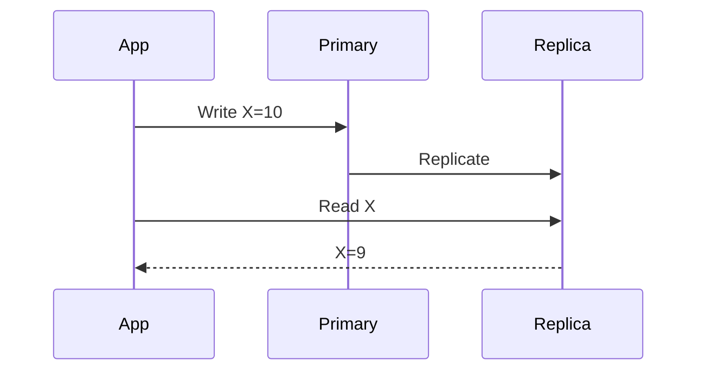
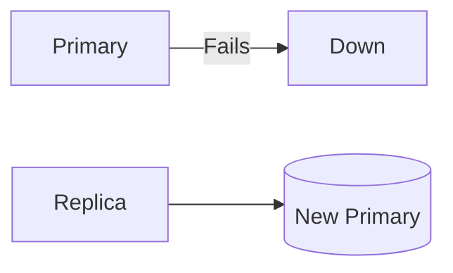
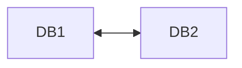

# Database Replication

> Goal: Understand how database replication works, why it is used, and how it helps with scalability, availability, and fault tolerance.

---

## 3.4.1 What Is Database Replication?

**Database replication** is the process of:
- Maintaining **multiple copies** of the same data
- Across different database nodes
- To improve **availability**, **read scalability**, and **fault tolerance**

```mermaid
graph LR
    App --> PrimaryDB[(Primary DB)]
    PrimaryDB --> Replica1[(Replica 1)]
    PrimaryDB --> Replica2[(Replica 2)]
````

> Replication copies data; it does **not** split data (that’s sharding).

---

## 3.4.2 Why Do We Need Replication?

Without replication:

* Single Point of Failure (SPOF)
* Limited read capacity
* Downtime during failures

With replication:

* Higher availability
* Better read performance
* Disaster recovery

---

## 3.4.3 Primary–Replica (Master–Slave) Replication ⭐⭐⭐⭐⭐

### How It Works

* **Primary** handles all writes
* **Replicas** copy data from primary
* Replicas usually handle reads

```mermaid
graph LR
    App --> Primary[(Primary)]
    Primary --> R1[(Replica 1)]
    Primary --> R2[(Replica 2)]
```

### Benefits

* Simple to implement
* Improves read scalability

### Limitations

* Primary is a bottleneck
* Write scalability is limited

---

## 3.4.4 Read Scaling with Replication

### Read-Heavy Workloads

Reads can be distributed across replicas.



> Replication is the **first solution** for read-heavy systems.

---

## 3.4.5 Replication Lag ⭐⭐⭐⭐⭐ (VERY IMPORTANT)

### What Is Replication Lag?

The delay between:

* Data being written to primary
* Data appearing on replicas



### Why It Matters

* Stale reads
* Inconsistent user experience

### Interview Line ⭐

> Replication improves availability but introduces eventual consistency.

---

## 3.4.6 Synchronous vs Asynchronous Replication

---

### Asynchronous Replication (Most Common)

* Primary does not wait for replicas
* Faster writes
* Possible replication lag

✔ High performance
❌ Stale reads possible

---

### Synchronous Replication

* Primary waits for replicas to confirm
* Stronger consistency
* Higher write latency

✔ Strong consistency
❌ Slower writes

---

## 3.4.7 Failover in Replicated Databases ⭐⭐⭐⭐

### What Is Failover?

Promoting a replica to primary when the primary fails.



### Challenges

* Data loss (if lag exists)
* Split-brain scenarios

---

## 3.4.8 Automatic vs Manual Failover

### Automatic Failover

* Fast recovery
* Complex to implement

### Manual Failover

* Slower
* Safer

> Production systems often combine both.

---

## 3.4.9 Multi-Primary (Multi-Master) Replication ⭐⭐⭐

### How It Works

* Multiple nodes accept writes
* Data is synchronized between them



### Benefits

* High availability
* Writes in multiple regions

### Problems

* Write conflicts
* Complex conflict resolution

> Rarely used for transactional systems.

---

## 3.4.10 Replication vs Sharding (Very Common Confusion)

| Aspect     | Replication          | Sharding           |
| ---------- | -------------------- | ------------------ |
| Purpose    | Availability & reads | Write & data scale |
| Data       | Same data copied     | Data partitioned   |
| Complexity | Lower                | Higher             |

> Replication copies data; sharding splits data.

---

## 3.4.11 Replication and CAP Theorem

* Replication → favors **Availability**
* Strong consistency → requires sync replication
* Async replication → eventual consistency

> Replication is a **CAP trade-off in action**.

---

## 3.4.12 Replication in a Payment System (Example)

* Primary DB for writes
* Replicas for reporting
* Strong consistency for balances
* Async replicas for analytics


---

## 3.4.13 Common Interview Mistakes ❌

❌ Confusing replication with sharding
❌ Ignoring replication lag
❌ Assuming replicas are always up-to-date

✅ Correct thinking:

* Replication improves reads & availability
* Lag is inevitable
* Writes don’t scale with replication alone

---

## Key Takeaways ⭐⭐⭐⭐⭐

* Replication copies data
* Improves availability and read scalability
* Primary is still a write bottleneck
* Replication lag causes eventual consistency
* Replication ≠ sharding

---

## Interview-Ready One-Liners ⭐

* “Replication improves read scalability.”
* “Replication introduces eventual consistency.”
* “Replication does not scale writes.”
* “Failover promotes a replica to primary.”

---

## References & Deep-Dive Resources

### Articles

* [https://www.geeksforgeeks.org/database-replication/](https://www.geeksforgeeks.org/database-replication/)
* [https://www.postgresql.org/docs/current/high-availability.html](https://www.postgresql.org/docs/current/high-availability.html)
* [https://dev.mysql.com/doc/refman/8.0/en/replication.html](https://dev.mysql.com/doc/refman/8.0/en/replication.html)

### Videos

* [https://www.youtube.com/watch?v=U4yLZPZ5vJQ](https://www.youtube.com/watch?v=U4yLZPZ5vJQ) (Database Replication Explained)
* [https://www.youtube.com/watch?v=E5nJQpW4t7U](https://www.youtube.com/watch?v=E5nJQpW4t7U) (Primary-Replica Replication)

### Books

* *Designing Data-Intensive Applications* – Martin Kleppmann
* *Database Internals* – Alex Petrov

---
