# Database Sharding

> Goal: Understand how sharding works, why it is needed, and how different sharding strategies affect scalability, performance, and complexity.

---

## 3.5.1 What Is Database Sharding?

**Database sharding** is the process of:
- **Splitting data** across multiple database nodes
- Each node stores **only a subset** of the data
- Together, all shards form the complete dataset

```mermaid
graph LR
    App --> Shard1[(Shard 1)]
    App --> Shard2[(Shard 2)]
    App --> Shard3[(Shard 3)]
````

> Sharding scales **writes and data size** by distributing load.

---

## 3.5.2 Why Do We Need Sharding?

Replication alone cannot:

* Scale writes
* Handle very large datasets

### Problems Without Sharding

* Single primary becomes write bottleneck
* Storage limits reached
* High contention

> **Replication scales reads.
> Sharding scales writes and data.**

---

## 3.5.3 Sharding vs Replication (Quick Recap)

| Aspect        | Replication         | Sharding                    |
| ------------- | ------------------- | --------------------------- |
| Purpose       | Availability, reads | Scalability (writes & data) |
| Data          | Same data copied    | Data split                  |
| Write scaling | ❌ No                | ✅ Yes                       |
| Complexity    | Lower               | Higher                      |

---

## 3.5.4 Shard Key (MOST IMPORTANT) ⭐⭐⭐⭐⭐

### What Is a Shard Key?

A **shard key** determines:

* Which shard stores a given record
* How evenly data & load are distributed

```text
shard_id = hash(shard_key) % number_of_shards
```

### Examples

* `user_id`
* `order_id`
* `customer_id`

> **Choosing the wrong shard key is the #1 sharding mistake.**

---

## 3.5.5 Range-Based Sharding ⭐⭐⭐⭐

### How It Works

Data is split by **ranges** of the shard key.

Example:

* Shard 1 → users 1–1,000
* Shard 2 → users 1,001–2,000

```mermaid
graph TD
    Users -->|1–1000| Shard1
    Users -->|1001–2000| Shard2
```



### Pros

* Simple
* Efficient range queries

### Cons

* **Hot shards**
* Uneven load

---

## 3.5.6 Hash-Based Sharding ⭐⭐⭐⭐⭐

### How It Works

Shard determined by hashing the shard key.


### Pros

* Even data distribution
* Avoids hot shards

### Cons

* Range queries are hard
* Resharding is expensive

> Most large-scale systems use **hash-based sharding**.

---

## 3.5.7 Consistent Hashing ⭐⭐⭐⭐⭐ (VERY IMPORTANT)

### Problem with Normal Hashing

Adding/removing shards causes **massive data movement**.

### Solution: Consistent Hashing

* Shards placed on a hash ring
* Only a small portion of data moves


### Benefits

* Easier scaling
* Minimal rebalancing

---

## 3.5.8 Directory-Based Sharding ⭐⭐⭐

### How It Works

* A lookup service maps keys → shards


### Pros

* Flexible
* Easy re-mapping

### Cons

* Directory is a SPOF
* Extra hop

---

## 3.5.9 Sharding & Query Routing

The application must:

* Know the shard key
* Route queries to the correct shard


> Cross-shard queries are **expensive**.

---

## 3.5.10 Cross-Shard Queries & Joins ⭐⭐⭐⭐

### Problem

* Joins across shards are slow
* Requires querying multiple shards

### Solutions

* Denormalization
* Scatter-gather queries
* Avoid cross-shard joins

> **Design queries around the shard key.**

---

## 3.5.11 Resharding Challenges ⭐⭐⭐⭐⭐

Resharding happens when:

* Data grows
* Traffic increases
* Shards become imbalanced

### Challenges

* Data movement
* Downtime risk
* Consistency during migration

> Resharding is **hard and risky**.

---

## 3.5.12 Sharding & Consistency

* Single shard → strong consistency possible
* Multi-shard transactions → very complex
* Often avoided or handled via application logic

> Distributed transactions + sharding = pain 😄

---

## 3.5.13 Sharding in a Payment System (Example)

* Shard by `user_id`
* Each shard handles its users’ transactions
* Global reports handled asynchronously


---

## 3.5.14 Common Interview Mistakes ❌

❌ Confusing replication with sharding
❌ Choosing timestamp as shard key
❌ Ignoring resharding
❌ Assuming joins are easy

✅ Correct thinking:

* Shard by access pattern
* Avoid cross-shard operations
* Plan for growth early

---

## Key Takeaways ⭐⭐⭐⭐⭐

* Sharding splits data
* Enables write & data scalability
* Shard key choice is critical
* Hash-based sharding is common
* Resharding is complex and risky

---

## Interview-Ready One-Liners ⭐

* “Replication scales reads; sharding scales writes.”
* “Shard key choice defines system scalability.”
* “Cross-shard joins are expensive.”
* “Consistent hashing minimizes data movement.”

---

## References & Deep-Dive Resources

### Articles

* [https://www.geeksforgeeks.org/database-sharding/](https://www.geeksforgeeks.org/database-sharding/)
* [https://aws.amazon.com/what-is/database-sharding/](https://aws.amazon.com/what-is/database-sharding/)
* [https://martinfowler.com/articles/patterns-of-distributed-systems/](https://martinfowler.com/articles/patterns-of-distributed-systems/)

### Videos

* [https://www.youtube.com/watch?v=E8vS0xNqzXU](https://www.youtube.com/watch?v=E8vS0xNqzXU) (Sharding Explained)
* [https://www.youtube.com/watch?v=ZQp9dHqH0L0](https://www.youtube.com/watch?v=ZQp9dHqH0L0) (Consistent Hashing)

### Books

* *Designing Data-Intensive Applications* – Martin Kleppmann
* *Database Internals* – Alex Petrov

---
