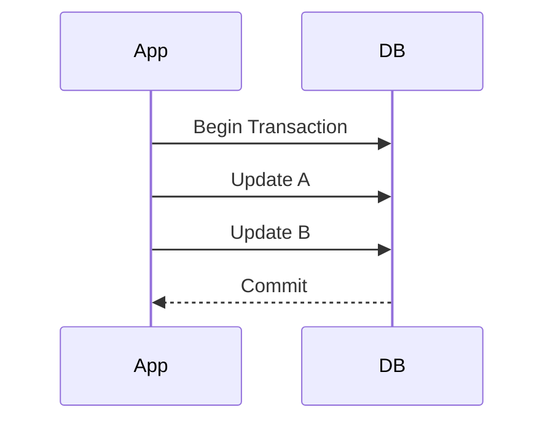
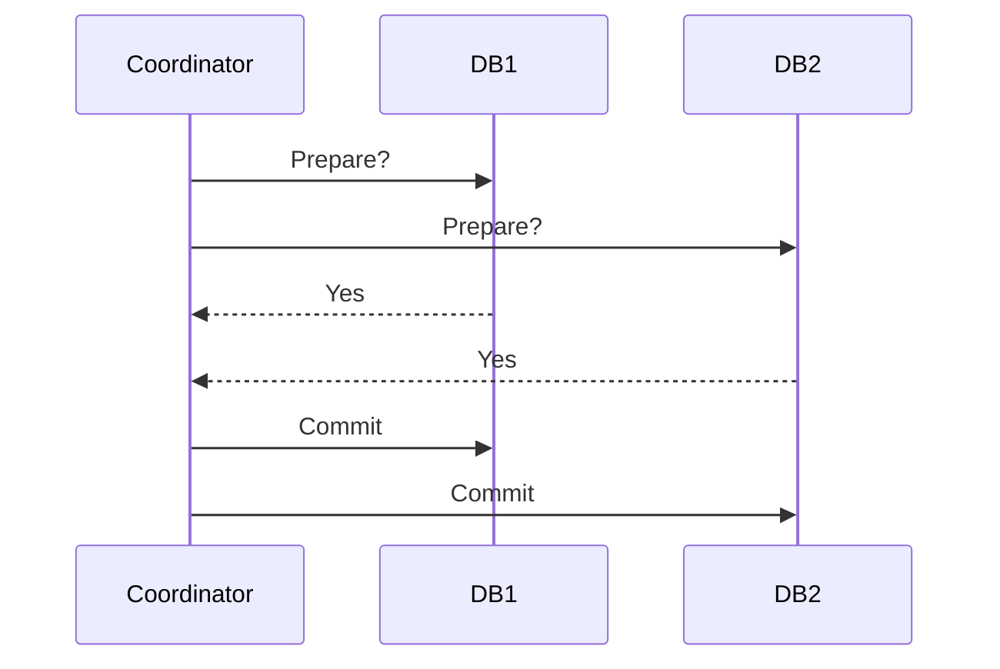

# Transactions & ACID

> Goal: Understand how databases guarantee correctness using transactions, what ACID really means, and how distributed transactions work.

---

## 3.6.1 What Is a Transaction?

A **transaction** is a group of database operations that must either:

- Complete entirely  
- Or fail entirely  

Example:
Transfer ₹100 from Account A to Account B:

```text
1. Deduct 100 from A
2. Add 100 to B
````

If one step fails, both must rollback.

> Transactions guarantee data correctness.

---

## 3.6.2 ACID Properties ⭐⭐⭐⭐⭐

ACID defines the guarantees provided by transactional databases.

---

### A — Atomicity

All operations succeed or none do.



If failure:

```text
Rollback entire transaction
```

---

### C — Consistency

The database moves from one valid state to another.

Example:

* Balance cannot become negative (if constraint exists)
* Foreign key constraints must hold

> Constraints enforce consistency.

---

### I — Isolation

Concurrent transactions should not interfere improperly.

Without isolation:

* Dirty reads
* Lost updates
* Inconsistent state

---

### D — Durability

Once committed:

* Data survives crashes
* Data written to disk

> Even after power failure, committed data remains.

---

## 3.6.3 Isolation Levels ⭐⭐⭐⭐⭐

Isolation controls how transactions see each other.

---

### 1. Read Uncommitted

* Can see uncommitted data
* Dirty reads possible

---

### 2. Read Committed

* Can see only committed data
* Most common default

---

### 3. Repeatable Read

* Same row read twice → same result
* Prevents non-repeatable reads

---

### 4. Serializable

* Highest isolation
* Behaves like transactions run one-by-one
* Slowest

---

### Common Problems

| Problem             | Description                 |
| ------------------- | --------------------------- |
| Dirty Read          | Read uncommitted data       |
| Non-repeatable Read | Value changes between reads |
| Phantom Read        | New rows appear             |

---

## 3.6.4 Trade-off: Isolation vs Performance

Higher isolation:

* More locking
* Lower concurrency
* Slower performance

> Serializable is safest but slowest.

---

## 3.6.5 Transactions in Distributed Systems ⭐⭐⭐⭐⭐

When multiple services or databases are involved:

Transaction spans multiple nodes.

Example:

* Payment service updates DB
* Order service updates DB
* Both must succeed or fail together

This becomes complex.

---

## 3.6.6 Two-Phase Commit (2PC) ⭐⭐⭐⭐⭐

Used for distributed transactions.

---

### Phase 1: Prepare

Coordinator asks:

> “Can you commit?”

All participants respond Yes/No.

---

### Phase 2: Commit

If all say Yes → Commit
If any say No → Rollback



---

## 3.6.7 Problems with 2PC

* Blocking protocol
* Coordinator failure issues
* Slow
* Not highly scalable

> Distributed transactions are expensive.

---

## 3.6.8 Why Microservices Avoid Distributed Transactions

Instead of 2PC:

* Use eventual consistency
* Use Saga pattern
* Compensating transactions

Example:

* Payment fails → refund issued later

---

## 3.6.9 ACID vs BASE

| ACID                  | BASE                        |
| --------------------- | --------------------------- |
| Strong consistency    | Eventual consistency        |
| Immediate correctness | Availability prioritized    |
| Used in RDBMS         | Used in distributed systems |

> Modern large systems often relax ACID for scalability.

---

## 3.6.10 Transactions in a Payment System

* Balance updates must be atomic
* Isolation required to prevent double spending
* Serializable or strong constraints needed

> Financial systems heavily rely on ACID.

---

## Key Takeaways ⭐⭐⭐⭐⭐

* Transactions ensure correctness
* ACID guarantees reliability
* Isolation levels affect performance
* Distributed transactions are complex
* 2PC is slow and blocking
* Microservices prefer eventual consistency

---

## Interview-Ready One-Liners ⭐

* “Atomicity ensures all-or-nothing.”
* “Isolation prevents dirty reads.”
* “Serializable is safest but slowest.”
* “2PC is blocking and expensive.”
* “Distributed transactions hurt scalability.”

---

## References

* Designing Data-Intensive Applications
* PostgreSQL Transaction Documentation
* Two-Phase Commit Explained (high level)