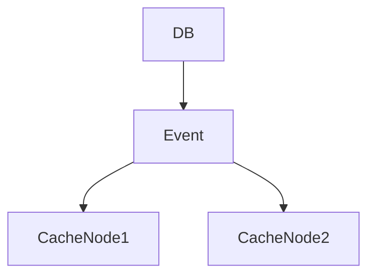

# Cache Invalidation

> Goal: Understand why cache invalidation is one of the hardest problems in system design and how to handle it correctly.

---

## 4.4.1 Why Cache Invalidation Is Hard ⭐⭐⭐⭐⭐

Cache improves performance, but introduces a new problem:

> How do we ensure cache data is not stale?

When database updates:
- Cache may still hold old data
- Multiple cache nodes may exist
- Timing issues may occur

This leads to:
- Stale reads
- Inconsistent user experience
- Data correctness issues

---

## 4.4.2 What Is Cache Invalidation?

Cache invalidation is the process of:
- Removing outdated data from cache
- Or updating cache when DB changes

Goal:
Ensure cache and DB stay logically consistent.

---

## 4.4.3 TTL-Based Invalidation ⭐⭐⭐

Each cache entry has a Time To Live.

Example:
```

TTL = 300 seconds

````

After expiry:
- Entry removed automatically
- Next read fetches from DB

### Benefits
- Simple
- Automatic cleanup

### Limitations
- Data may be stale until TTL expires
- Not immediate consistency

> TTL is a safety net, not a full solution.

---

## 4.4.4 Write-Invalidate Strategy ⭐⭐⭐⭐⭐

When data is updated:
1. Update DB
2. Delete cache entry

```mermaid
sequenceDiagram
    App->>DB: Update
    App->>Cache: Delete(key)
````

Next read:

* Fetch from DB
* Repopulate cache

### Benefits

* Simple
* Most common strategy

---

## 4.4.5 Write-Update Strategy ⭐⭐⭐⭐

When data is updated:

1. Update DB
2. Update cache with new value

```mermaid
sequenceDiagram
    App->>DB: Update
    App->>Cache: Set(key, new_value)
```

### Benefits

* Avoids cache miss
* Immediate freshness

### Drawbacks

* Higher write cost
* Complex in distributed systems

---

## 4.4.6 Race Conditions (Very Important) ⭐⭐⭐⭐⭐

Example problem:

1. Read request misses cache
2. DB fetch begins
3. Another write updates DB and invalidates cache
4. Old read writes stale data back to cache

Result:
Cache contains stale data.

> Race conditions are common in distributed systems.

---

## 4.4.7 Versioned Cache Keys ⭐⭐⭐⭐

Instead of:

```
user:123
```

Use:

```
user:123:v5
```

When data updates:

* Increment version
* Old cache entries naturally ignored

### Benefit

Avoids stale overwrites

---

## 4.4.8 Event-Driven Invalidation ⭐⭐⭐⭐⭐

When DB updates:

* Publish event
* All cache nodes invalidate corresponding keys



Used in distributed cache systems.

---

## 4.4.9 Cache Stampede (Very Important) ⭐⭐⭐⭐⭐

When:

* Popular key expires
* Thousands of requests hit DB simultaneously

Result:
Database overload

---

### Prevention Techniques

1. Request coalescing
2. Lock per key
3. Randomized TTL
4. Early refresh

---

## 4.4.10 Distributed Cache Invalidation Challenges

* Network delays
* Partial failures
* Replication lag
* Multiple cache nodes

Consistency becomes harder.

---

## 4.4.11 Cache Invalidation in Payment System

Rules:

* Immediately invalidate critical updates
* Avoid caching balances
* Use short TTL as backup
* Ensure idempotent updates

---

## 4.4.12 Common Interview Mistakes ❌

❌ Relying only on TTL
❌ Ignoring race conditions
❌ Forgetting distributed environment
❌ Treating cache as strongly consistent

✅ Correct thinking:

* DB is source of truth
* Combine TTL + explicit invalidation
* Handle race conditions carefully

---

## Key Takeaways ⭐⭐⭐⭐⭐

* Cache invalidation is hard due to distributed nature
* Write-invalidate is most common strategy
* TTL alone is insufficient
* Race conditions must be handled
* Cache stampede can overload DB

---

## Interview-Ready One-Liners ⭐

* “Cache invalidation is one of the hardest problems in computer science.”
* “TTL is a safety mechanism, not a consistency guarantee.”
* “Write-invalidate is the most common strategy.”
* “Race conditions cause stale cache bugs.”
