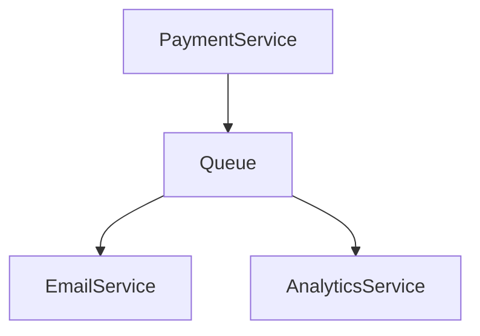

# Sync vs Async Communication

> Goal: Understand the difference between synchronous and asynchronous communication, and when to use each in system design.

---

## 5.1.1 What Is Synchronous Communication? ⭐⭐⭐⭐

In synchronous communication:

- Service A calls Service B
- Service A waits for response
- Execution is blocked until response arrives

```mermaid
sequenceDiagram
    Client->>ServiceA: Request
    ServiceA->>ServiceB: API Call
    ServiceB-->>ServiceA: Response
    ServiceA-->>Client: Response
````

### Characteristics

* Blocking
* Immediate response
* Tight coupling
* Failure propagates upward

> Caller waits until callee finishes.

---

## 5.1.2 What Is Asynchronous Communication? ⭐⭐⭐⭐⭐

In asynchronous communication:

* Service A sends a message
* Does NOT wait for response
* Processing happens later

```mermaid
sequenceDiagram
    Client->>ServiceA: Request
    ServiceA->>Queue: Publish Event
    ServiceA-->>Client: Immediate Response
    Queue->>ServiceB: Process Later
```

### Characteristics

* Non-blocking
* Loose coupling
* Better scalability
* Failure isolation

> Caller does not wait for processing to finish.

---

## 5.1.3 Blocking vs Non-Blocking

### Blocking

* Thread waits
* Cannot do other work

### Non-Blocking

* Thread continues execution
* Callback or event handles response later

---

## 5.1.4 REST vs Messaging ⭐⭐⭐⭐⭐

### REST (Synchronous)

* HTTP request-response model
* Immediate reply
* Strong coupling

Example:

```
POST /processPayment
```

---

### Messaging (Asynchronous)

* Producer sends message
* Consumer processes later
* No immediate reply required

Example:

```
PaymentProcessed event
```

---

## 5.1.5 When to Use Synchronous Communication

Use when:

* Immediate response required
* Strong consistency needed
* User waiting for result
* Transactional operations

Examples:

* Login request
* Payment confirmation
* Form submission

---

## 5.1.6 When to Use Asynchronous Communication ⭐⭐⭐⭐⭐

Use when:

* Task can be delayed
* High traffic expected
* Side effects triggered
* System needs loose coupling

Examples:

* Sending emails
* Updating analytics
* Generating reports
* Notifications

---

## 5.1.7 Failure Handling Comparison

### Synchronous

If downstream service fails:

* Entire request fails

### Asynchronous

If consumer fails:

* Message can be retried
* System remains responsive

---

## 5.1.8 Scalability Comparison

| Aspect            | Synchronous | Asynchronous             |
| ----------------- | ----------- | ------------------------ |
| Latency           | Higher      | Lower (initial response) |
| Coupling          | Tight       | Loose                    |
| Failure Isolation | Weak        | Strong                   |
| Scalability       | Limited     | High                     |

---

## 5.1.9 Real-World Example (Payment System)

### Synchronous Flow

* User clicks Pay
* Payment processed
* Confirmation returned

### Asynchronous Flow

* Payment success event published
* Email sent
* Analytics updated
* Notification triggered



> Critical operations are synchronous; side-effects are asynchronous.

---

## 5.1.10 Common Interview Mistakes ❌

❌ Using async when immediate consistency required
❌ Using sync for heavy background processing
❌ Ignoring retry mechanisms
❌ Forgetting idempotency in async systems

✅ Correct thinking:

* Use sync for user-facing critical operations
* Use async for scalability and decoupling

---

## Key Takeaways ⭐⭐⭐⭐⭐

* Synchronous = blocking, immediate response
* Asynchronous = non-blocking, eventual processing
* REST is typically synchronous
* Messaging enables asynchronous architecture
* Async improves scalability and resilience

---

## Interview-Ready One-Liners ⭐

* “Synchronous calls block; asynchronous calls decouple.”
* “Use async for side effects.”
* “Async improves failure isolation.”
* “Critical paths are sync; non-critical paths are async.”