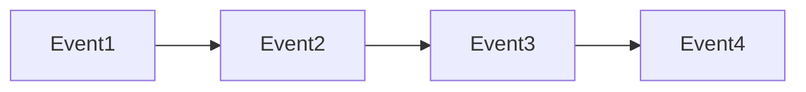
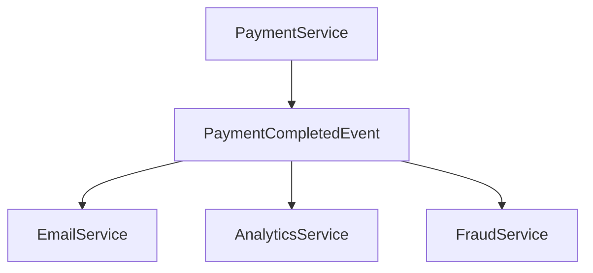

# Event-Driven Architecture (EDA)

> Goal: Understand how event-driven systems work, how pub-sub enables decoupling, and how event streams and idempotency fit into modern distributed systems.

---

## 5.4.1 What Is Event-Driven Architecture? ⭐⭐⭐⭐⭐

Event-Driven Architecture (EDA) is a design pattern where:

- Services communicate by producing and consuming events.
- Systems react to events instead of direct synchronous calls.

```mermaid
graph TD
    ServiceA --> Event
    Event --> ServiceB
    Event --> ServiceC
````

> Systems react to events rather than calling each other directly.

---

## 5.4.2 What Is an Event?

An event is:

* A record of something that happened
* Immutable
* Timestamped

Examples:

* `OrderPlaced`
* `PaymentCompleted`
* `UserRegistered`

Events describe facts, not commands.

---

## 5.4.3 Pub-Sub Model ⭐⭐⭐⭐⭐

In Publish–Subscribe:

* Publisher emits event
* Topic stores event
* Multiple subscribers consume it

```mermaid
graph TD
    Publisher --> Topic
    Topic --> Subscriber1
    Topic --> Subscriber2
```

### Key Properties

* Loose coupling
* One-to-many communication
* Independent scaling

---

## 5.4.4 Event Streams ⭐⭐⭐⭐

Events are stored as an append-only log.



Benefits:

* Replay capability
* Auditing
* Debugging
* Reprocessing

> Streams represent history of events.

---

## 5.4.5 Event Sourcing (Intro) ⭐⭐⭐⭐

Instead of storing current state:

* Store all events
* Rebuild state by replaying events

Example:
Instead of:

```
Balance = 500
```

Store:

```
+100
-50
+200
-150
```

Current balance = sum of events

---

### Benefits

* Full audit history
* Time travel debugging
* Better traceability

### Challenges

* More storage
* Complex reconstruction
* Harder debugging

---

## 5.4.6 Idempotency in Event-Driven Systems ⭐⭐⭐⭐⭐

Because events may be delivered more than once:

Consumers must be idempotent.

Example:
If `OrderCompleted` event processed twice:

* System should not ship twice.

Solution:

* Use unique event ID
* Track processed events

---

## 5.4.7 Benefits of Event-Driven Architecture ⭐⭐⭐⭐⭐

* Loose coupling
* High scalability
* Independent deployment
* Failure isolation
* Real-time processing

---

## 5.4.8 Challenges of EDA ⭐⭐⭐⭐

* Debugging complexity
* Event versioning issues
* Ordering problems
* Data consistency delays
* Monitoring difficulty

> EDA improves scalability but increases complexity.

---

## 5.4.9 Event-Driven Example (Payment System)

Flow:

1. User makes payment
2. `PaymentCompleted` event published
3. Multiple services react:



Payment service does not know about other services.

---

## 5.4.10 Event vs Command

| Event              | Command      |
| ------------------ | ------------ |
| Something happened | Do something |
| Immutable fact     | Instruction  |
| Broadcast          | Directed     |

Example:

* Event: `OrderPlaced`
* Command: `ProcessOrder`

---

## 5.4.11 When to Use Event-Driven Architecture

Use when:

* Multiple systems react to same event
* High scalability required
* Loose coupling desired
* Real-time processing needed

Avoid when:

* Simple CRUD app
* Strong immediate consistency required

---

## 5.4.12 Common Interview Mistakes ❌

❌ Confusing event with command
❌ Ignoring idempotency
❌ Assuming global ordering
❌ Ignoring monitoring challenges

✅ Correct thinking:

* Events are immutable facts
* Consumers must be idempotent
* EDA increases scalability but adds complexity

---

## Key Takeaways ⭐⭐⭐⭐⭐

* EDA uses events for communication
* Pub-sub enables loose coupling
* Event streams enable replay
* Event sourcing stores full history
* Idempotency is critical

---

## Interview-Ready One-Liners ⭐

* “Event-driven systems react to facts.”
* “Pub-sub enables loose coupling.”
* “Event sourcing stores history, not just state.”
* “Idempotent consumers prevent duplicate side effects.”