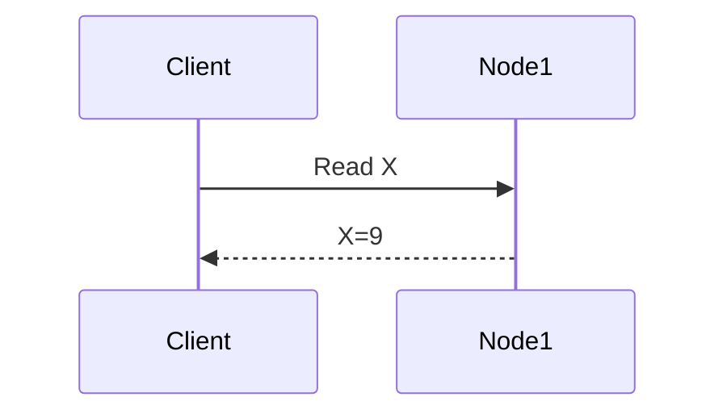
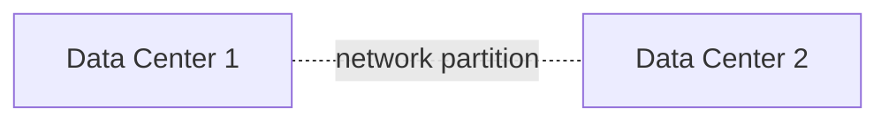
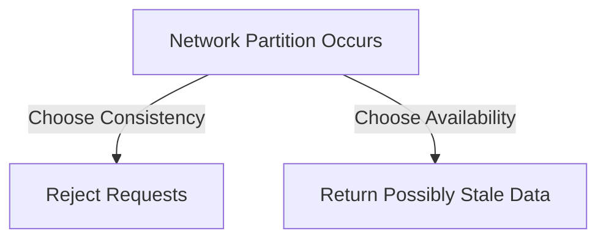

# CAP Theorem

> Goal: Understand the fundamental trade-offs in distributed systems and how real-world systems choose between Consistency and Availability.

---

## 1.4.1 What Is the CAP Theorem?

The **CAP Theorem** states that **in a distributed system**, you can guarantee **at most two** of the following three properties **at the same time**:

- **Consistency (C)**
- **Availability (A)**
- **Partition Tolerance (P)**

```mermaid
graph TD
    C[Consistency]
    A[Availability]
    P[Partition Tolerance]

    C --- A
    A --- P
    C --- P
````

> You can choose **any two**, but **never all three**.

---

## 1.4.2 Why CAP Theorem Exists

In distributed systems:

* Nodes run on different machines
* Network failures are inevitable
* Messages can be delayed or lost

👉 **Network partition is not optional** — it *will* happen.

Therefore:

> **Partition Tolerance is mandatory** in real distributed systems.

---

## 1.4.3 The Three CAP Properties Explained

---

### Consistency (C)

**Definition**
Every read receives the **most recent write**.

Example:

* User updates email
* Immediately reads profile
* Always sees updated email

```mermaid
sequenceDiagram
    Client->>Node1: Write X=10
    Client->>Node2: Read X
    Node2-->>Client: X=10
```

✔ Strong data correctness
❌ Higher latency, reduced availability during failures

---

### Availability (A)

**Definition**
Every request receives a response (success or failure), even during failures.

Example:

* System always responds
* Might return stale data



✔ System is always responsive
❌ Data may be stale or inconsistent

---

### Partition Tolerance (P)

**Definition**
The system continues to operate despite **network failures** between nodes.

Example:

* Data centers cannot communicate
* System must still function



✔ Mandatory for distributed systems
❌ Forces trade-offs between C and A

---

## 1.4.4 Why You Can’t Have C, A, and P Together

During a **network partition**, the system must choose:

### Option 1: Consistency over Availability (CP)

* Reject requests to maintain correctness
* Some users get errors

### Option 2: Availability over Consistency (AP)

* Always respond
* Data may be stale



> This decision defines your system’s CAP category.

---

## 1.4.5 CP Systems (Consistency + Partition Tolerance)

### Characteristics

* Strong consistency
* May reject requests during partitions

### Examples

* Banking systems
* Payment systems
* Distributed databases with quorum

✔ Correct data
❌ Lower availability during failures

---

## 1.4.6 AP Systems (Availability + Partition Tolerance)

### Characteristics

* Always respond
* Eventual consistency

### Examples

* Social media feeds
* Caching systems
* DNS

✔ High availability
❌ Temporary inconsistency

---

## 1.4.7 CA Systems – Why They Don’t Exist at Scale

### CA = Consistency + Availability

* Works **only if no partition**
* Not realistic in distributed systems

Example:

* Single-node database
* Single data center system

> Once you distribute the system, **CA is no longer possible**.

---

## 1.4.8 CAP in Real-World Systems (IMPORTANT)

| System Type       | CAP Choice | Reason                     |
| ----------------- | ---------- | -------------------------- |
| Payment systems   | CP         | Correctness > availability |
| Banking ledger    | CP         | No stale data allowed      |
| Social media feed | AP         | Availability > consistency |
| Cache (Redis)     | AP         | Fast responses             |
| DNS               | AP         | Must always respond        |

---

## 1.4.9 CAP Is Not a Static Choice (Very Important Insight)

Modern systems are:

* **Mostly AP**
* **Selectively CP**

Example:

* Show cached feed (AP)
* Write comment with strong consistency (CP)

> CAP choices can be **operation-specific**, not system-wide.

---

## 1.4.10 Common CAP Misconceptions ❌

❌ “CAP means you choose two forever”
❌ “AP systems are wrong”
❌ “Consistency means immediate sync everywhere”

✅ Reality:

* CAP applies **only during partitions**
* Systems mix strategies
* Consistency has levels

---

## 1.4.11 CAP and Latency Relationship

* Strong consistency → more coordination → higher latency
* Availability → faster responses → possible staleness

> CAP decisions directly affect **latency and user experience**.

---

## Key Takeaways ⭐⭐⭐⭐⭐

* Network partitions are unavoidable
* Partition tolerance is mandatory
* During partition: choose **C or A**
* CP → correctness
* AP → availability
* Real systems mix both

---

## Interview-Ready One-Liners ⭐

* “CAP trade-offs occur only during network partitions.”
* “Partition tolerance is mandatory in distributed systems.”
* “Payments prefer CP, feeds prefer AP.”
* “Modern systems make CAP decisions per operation.”

---

## References & Deep-Dive Resources

### Articles

* [https://www.geeksforgeeks.org/cap-theorem-in-distributed-system/](https://www.geeksforgeeks.org/cap-theorem-in-distributed-system/)
* [https://www.ibm.com/topics/cap-theorem](https://www.ibm.com/topics/cap-theorem)
* [https://martinfowler.com/articles/patterns-of-distributed-systems/](https://martinfowler.com/articles/patterns-of-distributed-systems/)

### Videos

* [https://www.youtube.com/watch?v=k-Yaq8AHlFA](https://www.youtube.com/watch?v=k-Yaq8AHlFA) (CAP Theorem Explained)
* [https://www.youtube.com/watch?v=1Cw1y9z0S6E](https://www.youtube.com/watch?v=1Cw1y9z0S6E) (CAP with Examples)

### Books

* *Designing Data-Intensive Applications* – Martin Kleppmann
* *Distributed Systems* – Tanenbaum

---
