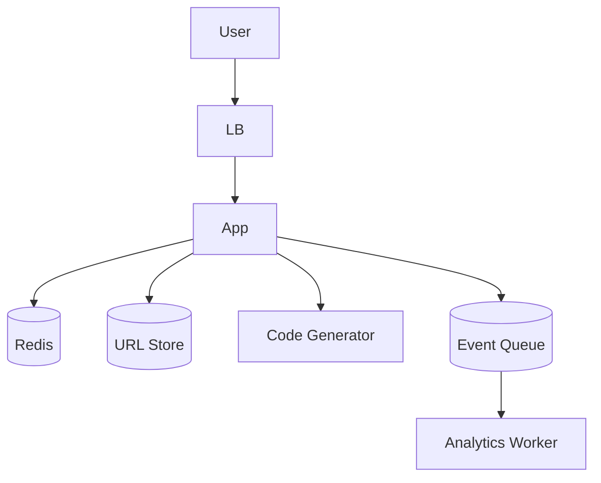

# URL Shortener System Design

> Goal: Design a TinyURL/Bitly-like service that converts long URLs into short links and redirects users reliably at scale.

---

## 10.1.1 Requirements

### Functional
- Create short URL from long URL
- Redirect short URL to original long URL
- Optional custom alias support
- Optional expiry time for links
- Basic click analytics

### Non-Functional
- High read throughput (redirect-heavy)
- Low redirect latency
- High availability
- No collisions in generated short codes
- Durable mapping storage

---

## 10.1.2 APIs

### Create Short URL
`POST /api/v1/shorten`

Request:
```json
{
  "longUrl": "https://example.com/very/long/path",
  "customAlias": "optional",
  "expiresAt": "optional-iso-time"
}
```

Response:
```json
{
  "shortUrl": "https://sho.rt/ab12Cd",
  "code": "ab12Cd"
}
```

### Redirect
`GET /{code}` → HTTP `302` to long URL

---

## 10.1.3 High-Level Architecture



Flow:
1. Create request reaches app.
2. App validates URL.
3. App generates unique code (or validates custom alias).
4. Mapping stored in DB and cache.
5. Redirect reads from cache first, DB fallback.

---

## 10.1.4 Database Design

Table: `url_mapping`
- `id` (bigint, PK)
- `code` (varchar, unique index)
- `long_url` (text)
- `created_at`
- `expires_at` (nullable)
- `user_id` (nullable)

Table: `click_events` (optional stream/warehouse)
- `code`
- `timestamp`
- `ip_hash`
- `user_agent`
- `referrer`

---

## 10.1.5 Code Generation Strategies

1. **Auto-increment ID + Base62 encoding**
   - Simple and deterministic
2. **Random string + collision check**
   - Easy but needs retries
3. **Pre-generated key pool**
   - Good for predictable latency

Use Base62 (`a-zA-Z0-9`) for short readable codes.

---

## 10.1.6 Scaling Strategies

- Cache hot mappings in Redis
- CDN in front of redirect endpoint
- Read replicas for heavy read load
- Partition analytics pipeline from core redirect path
- Separate write path (shorten) and read path (redirect)

---

## 10.1.7 Failure Scenarios

- **Cache down**: fallback to DB
- **DB primary down**: failover to replica
- **Code collision**: regenerate + retry
- **Abuse/spam links**: add rate limiting and blocklists

---

## 10.1.8 Common Interview Mistakes ❌

❌ Ignoring read-heavy nature
❌ No unique constraint on `code`
❌ Logging raw PII in analytics
❌ Storing analytics on synchronous redirect path
