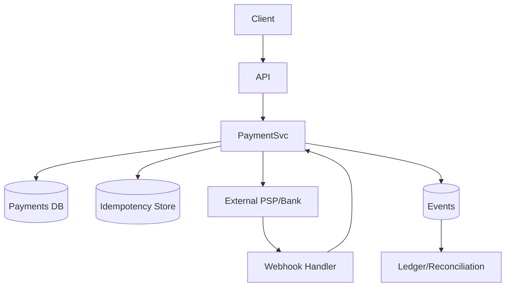

# Payment Gateway System Design

> Goal: Design a secure, reliable system that authorizes, captures, and records payments without double-charging users.

---

## 10.2.1 Requirements

### Functional
- Create payment intent
- Authorize and capture payment
- Handle success/failure callbacks
- Refund support
- Payment status tracking

### Non-Functional
- Strong correctness (no duplicate charge)
- High reliability
- Auditability and compliance
- Low latency for authorization

---

## 10.2.2 Core Architecture



---

## 10.2.3 API Design

`POST /payments`
```json
{
  "orderId": "ord_123",
  "amount": 1500,
  "currency": "USD",
  "methodToken": "tok_xxx"
}
```
Headers:
- `Idempotency-Key: <uuid>`

`GET /payments/{paymentId}`
- Returns status: `PENDING | AUTHORIZED | CAPTURED | FAILED | REFUNDED`

---

## 10.2.4 Data Model

Table `payments`
- `payment_id` (PK)
- `order_id` (unique)
- `amount`, `currency`
- `status`
- `psp_reference`
- `created_at`, `updated_at`

Table `idempotency_keys`
- `key` (PK)
- `request_hash`
- `response_payload`
- `expires_at`

---

## 10.2.5 Reliability Patterns

- Idempotency keys prevent duplicate charges
- Retries with exponential backoff for transient failures
- Webhooks for eventual final status
- Outbox pattern for reliable event publishing
- Reconciliation job compares internal ledger with PSP settlements

---

## 10.2.6 Security Considerations

- TLS everywhere
- Tokenized card data only (no raw PAN storage)
- Signed webhook verification
- Strict RBAC and audit logs
- PCI-DSS compliant boundaries

---

## 10.2.7 Failure Scenarios

- Timeout to PSP: mark pending, retry safely with same idempotency key
- Webhook delay: status remains pending until callback/reconciliation
- Duplicate callback: handle idempotently by event ID
- Partial outage: degrade non-critical features, preserve payment correctness

---

## 10.2.8 Common Interview Mistakes ❌

❌ No idempotency design
❌ Treating timeout as failure without reconciliation
❌ Ignoring signed webhook validation
❌ No ledger/audit trail
