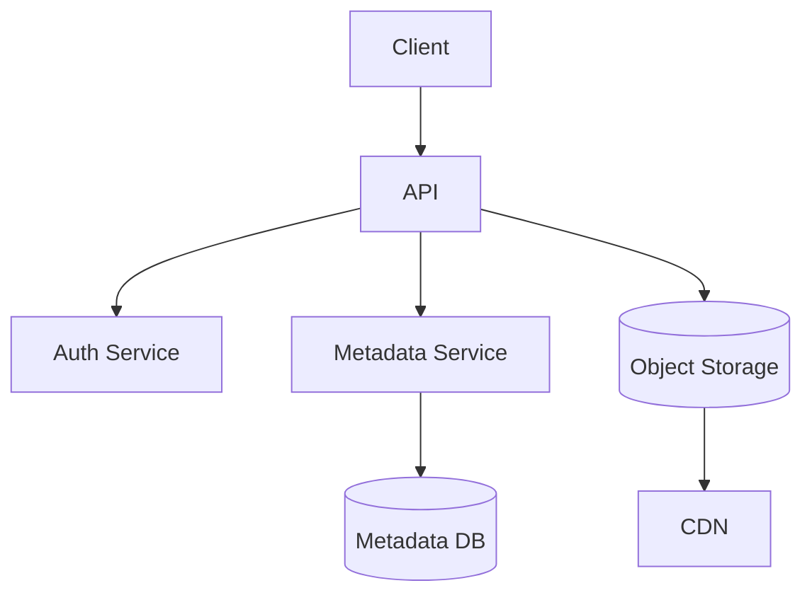

# File Storage System Design (Google Drive-like)

> Goal: Build a scalable file storage platform that supports upload/download, sharing, and versioning.

---

## 10.4.1 Requirements

### Functional
- Upload and download files
- Folder hierarchy
- File sharing (read/write)
- Version history
- Search by metadata

### Non-Functional
- High durability
- Availability
- Efficient large file transfer
- Secure access control

---

## 10.4.2 Core Architecture

---

## 10.4.3 Upload Flow

1. Client requests upload session.
2. API returns pre-signed upload URLs (chunked).
3. Client uploads chunks directly to object storage.
4. Metadata service commits file record after all chunks complete.

---

## 10.4.4 Data Model

Table `files`
- `file_id` (PK)
- `owner_id`
- `name`
- `path`
- `size_bytes`
- `mime_type`
- `object_key`
- `version`

Table `shares`
- `file_id`
- `shared_with_user_id`
- `permission` (`READ/WRITE`)

---

## 10.4.5 Storage Design Choices

- Blob/object store for file bytes
- Relational DB for metadata and permissions
- Content-addressed chunks for dedup (optional)
- CDN for download acceleration

---

## 10.4.6 Reliability & Consistency

- Multi-AZ object replication
- Checksums for data integrity
- Metadata transaction boundaries
- Background repair jobs for missing/corrupt chunks

---

## 10.4.7 Security

- Signed URLs with short expiry
- Encryption at rest + in transit
- Fine-grained ACLs
- Malware scanning pipeline
- Audit logs for share/access actions

---

## 10.4.8 Failure Scenarios

- Chunk upload interrupted: resume from last successful chunk
- Metadata write fails after blob upload: cleanup orphan objects asynchronously
- Hot file download spike: cache via CDN and edge throttling

---

## 10.4.9 Common Interview Mistakes ❌

❌ Storing large file blobs directly in relational DB
❌ No resumable upload support
❌ Ignoring permission model complexity
❌ No cleanup plan for orphaned data
