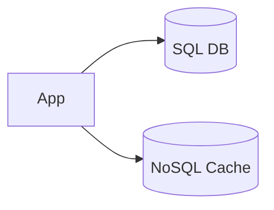

# SQL vs NoSQL

> Goal: Understand how to choose the right database type based on system requirements, scalability needs, and data access patterns.

---

## 3.1.1 Why Database Choice Matters in System Design

The database is often:
- The **first bottleneck**
- The **hardest component to scale**
- The **source of data truth**

> A poor database choice can break an otherwise good system design.

---

## 3.1.2 What Is an SQL Database?

SQL (Relational) databases store data in:
- Tables
- Rows & columns
- Fixed schema

Examples:
- MySQL
- PostgreSQL
- Oracle

```mermaid
graph TD
    Table1[Users Table]
    Table2[Orders Table]

    Table1 -->|user_id| Table2
````

### Key Characteristics

* Structured schema
* ACID transactions
* Strong consistency
* Powerful querying (joins)

---

## 3.1.3 What Is a NoSQL Database?

NoSQL databases:

* Do not rely on relational tables
* Are schema-flexible
* Are designed for horizontal scaling

Examples:

* Key-Value (Redis)
* Document (MongoDB)
* Column-family (Cassandra)
* Graph (Neo4j)

```mermaid
graph TD
    Doc1[User Document]
    Doc2[Order Document]
```

---

## 3.1.4 Types of NoSQL Databases

### 1️⃣ Key-Value Stores

* Data stored as key → value

Use cases:

* Caching
* Session storage

---

### 2️⃣ Document Databases

* JSON-like documents
* Flexible schema

Use cases:

* User profiles
* Content management

---

### 3️⃣ Column-Family Databases

* Optimized for large-scale writes

Use cases:

* Analytics
* Time-series data

---

### 4️⃣ Graph Databases

* Nodes & edges
* Relationship-heavy data

Use cases:

* Social networks
* Recommendation systems

---

## 3.1.5 ACID vs BASE ⭐⭐⭐⭐⭐

### ACID (SQL)

| Property    | Meaning         |
| ----------- | --------------- |
| Atomicity   | All or nothing  |
| Consistency | Valid state     |
| Isolation   | No interference |
| Durability  | Data not lost   |

---

### BASE (NoSQL)

| Property             | Meaning                 |
| -------------------- | ----------------------- |
| Basically Available  | System responds         |
| Soft State           | Temporary inconsistency |
| Eventual Consistency | Data converges          |

> ACID prioritizes correctness, BASE prioritizes availability.

---

## 3.1.6 SQL vs NoSQL – Core Comparison ⭐⭐⭐⭐⭐

| Aspect       | SQL               | NoSQL            |
| ------------ | ----------------- | ---------------- |
| Schema       | Fixed             | Flexible         |
| Transactions | Strong (ACID)     | Limited          |
| Joins        | Yes               | No / Limited     |
| Scaling      | Vertical (mostly) | Horizontal       |
| Consistency  | Strong            | Eventual (often) |

---

## 3.1.7 When to Use SQL Databases

Use SQL when:

* Data relationships are complex
* Transactions are critical
* Strong consistency required

Examples:

* Banking systems
* Payment systems
* Order management

### Interview Line ⭐

> If correctness matters more than scale, choose SQL.

---

## 3.1.8 When to Use NoSQL Databases

Use NoSQL when:

* Schema evolves frequently
* Massive scale required
* High read/write throughput needed

Examples:

* Social media feeds
* Logs and analytics
* Caching layers

### Interview Line ⭐

> If scale and flexibility matter more than strict consistency, choose NoSQL.

---

## 3.1.9 SQL + NoSQL Together (Very Common) ⭐⭐⭐⭐⭐

Real systems often use **both**.

Example:

* SQL → transactions
* NoSQL → caching, feeds



> Polyglot persistence is the norm.

---

## 3.1.10 Impact on Scalability

* SQL:

  * Strong consistency
  * Harder to shard
* NoSQL:

  * Built for horizontal scaling
  * Easier sharding

> Scaling databases is harder than scaling services.

---

## 3.1.11 Common Interview Mistakes ❌

❌ “NoSQL is always faster”
❌ “SQL can’t scale”
❌ “Use one DB for everything”

✅ Reality:

* Both can scale
* Choice depends on use case
* Hybrid systems are common

---

## Key Takeaways ⭐⭐⭐⭐⭐

* SQL → correctness & relationships
* NoSQL → scalability & flexibility
* ACID vs BASE is the core trade-off
* Databases define system limits
* Most real systems use multiple databases

---

## Interview-Ready One-Liners ⭐

* “Database choice defines scalability.”
* “SQL for transactions, NoSQL for scale.”
* “Polyglot persistence is common.”
* “ACID trades availability for correctness.”

---

## References & Deep-Dive Resources

### Articles

* [https://www.geeksforgeeks.org/difference-between-sql-and-nosql/](https://www.geeksforgeeks.org/difference-between-sql-and-nosql/)
* [https://aws.amazon.com/nosql/](https://aws.amazon.com/nosql/)
* [https://martinfowler.com/articles/nosql-introduction.html](https://martinfowler.com/articles/nosql-introduction.html)

### Videos

* [https://www.youtube.com/watch?v=ZS_kXvOeQ5Y](https://www.youtube.com/watch?v=ZS_kXvOeQ5Y) (SQL vs NoSQL Explained)
* [https://www.youtube.com/watch?v=I3X1hYjL4wM](https://www.youtube.com/watch?v=I3X1hYjL4wM) (ACID vs BASE)

### Books

* *Designing Data-Intensive Applications* – Martin Kleppmann
* *Database Internals* – Alex Petrov

---
