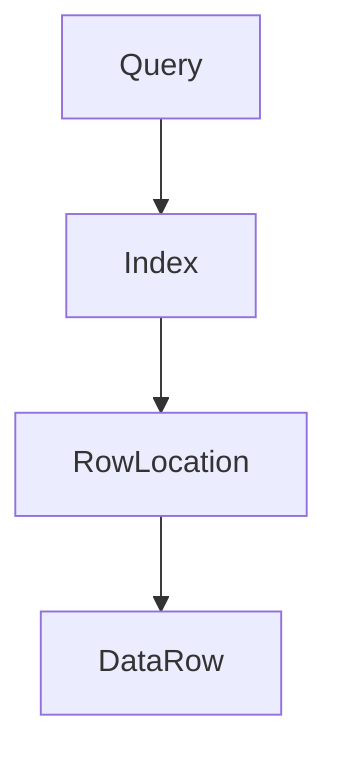
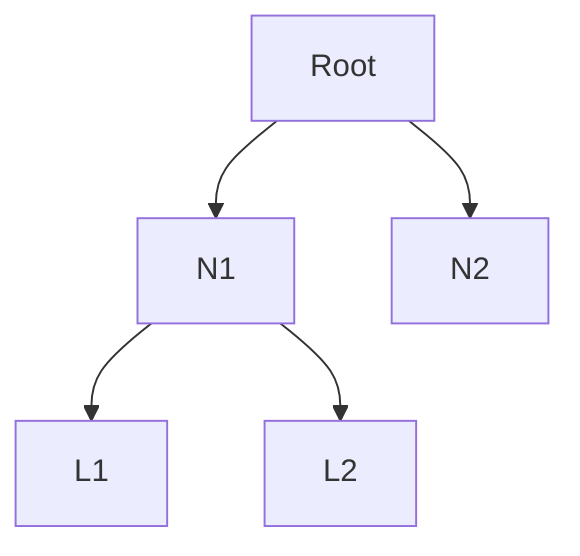
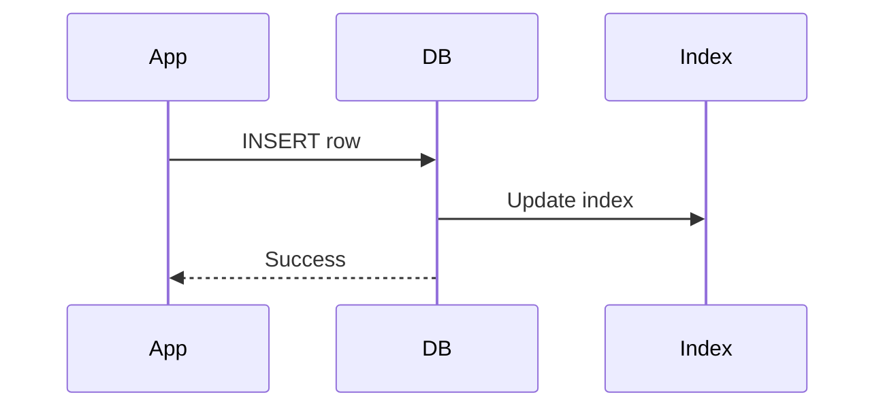

# Indexing

> Goal: Understand how indexing works, why it improves performance, and how to use it correctly in system design.

---

## 3.3.1 What Is an Index?

An **index** is a data structure that allows the database to **find rows faster** without scanning the entire table.

Think of it like:
> The index of a book — you don’t read every page to find a topic.

---

## 3.3.2 Why Indexing Matters in System Design

Without indexing:
- Queries become slow as data grows
- Databases become bottlenecks
- Systems fail at scale

With indexing:
- Faster reads
- Lower latency
- Better scalability

> Indexing is the **first optimization** before scaling databases.

---

## 3.3.3 How Indexing Works (High Level)

Without index:
```text
Scan every row → O(n)
````

With index:

```text
Use index → O(log n)
```



---

## 3.3.4 Common Index Data Structures ⭐⭐⭐⭐

### B-Tree Index (Most Common)

* Balanced tree
* Ordered data
* Efficient range queries



Used in:

* MySQL
* PostgreSQL
* Oracle

---

### Hash Index

* Key → hash → value
* Very fast lookups
* No range queries


Used in:

* In-memory databases
* Caching systems

---

## 3.3.5 What Columns Should Be Indexed?

Good candidates:

* Primary keys
* Foreign keys
* Columns used in `WHERE`
* Columns used in `JOIN`
* Columns used in `ORDER BY`

Bad candidates:

* Low-cardinality columns (e.g., gender)
* Columns frequently updated

---

## 3.3.6 Read vs Write Trade-Off ⭐⭐⭐⭐⭐

Indexes improve **reads**, but slow down **writes**.

Why?

* Index must be updated on INSERT/UPDATE/DELETE



> More indexes = slower writes.

---

## 3.3.7 Single-Column vs Composite Indexes ⭐⭐⭐⭐

### Single-Column Index

```sql
INDEX(user_id)
```

### Composite Index

```sql
INDEX(user_id, created_at)
```

Rule:

> Index order matters.


Query works for:

* `WHERE user_id = ?`
* `WHERE user_id = ? AND created_at > ?`

❌ Not optimal for:

* `WHERE created_at = ?`

---

## 3.3.8 Covering Index ⭐⭐⭐⭐

### What Is a Covering Index?

An index that contains **all columns needed by the query**.

```sql
SELECT name FROM users WHERE email = ?
```

Index:

```text
(email, name)
```

No table lookup needed.

> Covering indexes are extremely fast.

---

## 3.3.9 Indexing in NoSQL Databases

* Document DBs support indexes on fields
* Key-value DBs index keys only
* Column DBs use different storage patterns

> Indexing exists beyond SQL — but works differently.

---

## 3.3.10 Indexing & Memory Usage

Indexes:

* Consume memory
* Increase storage cost

Trade-off:

* Faster queries
* Higher resource usage

---

## 3.3.11 Common Indexing Mistakes ❌

❌ Indexing everything
❌ Ignoring write-heavy workload
❌ Wrong index order
❌ Not monitoring index usage

✅ Correct approach:

* Index based on queries
* Measure before adding

---

## 3.3.12 Indexing Example: User Table

### Table

```text
users(id, email, name, created_at)
```

### Common Queries

```sql
SELECT * FROM users WHERE email = ?
```

### Correct Index

```text
INDEX(email)
```

---

## 3.3.13 When Indexing Is Not Enough

If indexes can’t solve:

* Very large datasets
* Very high QPS

Then move to:

* Caching
* Read replicas
* Sharding

> Indexing is **step 1**, not the final solution.

---

## Key Takeaways ⭐⭐⭐⭐⭐

* Indexes speed up reads
* Indexes slow down writes
* B-Tree is the most common index
* Composite index order matters
* Indexing comes before scaling

---

## Interview-Ready One-Liners ⭐

* “Indexes trade write speed for read performance.”
* “B-Tree indexes support range queries.”
* “Composite index order matters.”
* “Indexing is the first DB optimization.”

---

## References & Deep-Dive Resources

### Articles

* [https://www.geeksforgeeks.org/indexing-in-databases/](https://www.geeksforgeeks.org/indexing-in-databases/)
* [https://use-the-index-luke.com/](https://use-the-index-luke.com/)
* [https://www.postgresql.org/docs/current/indexes.html](https://www.postgresql.org/docs/current/indexes.html)

### Videos

* [https://www.youtube.com/watch?v=NI9wYuVIYcA](https://www.youtube.com/watch?v=NI9wYuVIYcA) (Database Indexing Explained)
* [https://www.youtube.com/watch?v=HubezKbFL7E](https://www.youtube.com/watch?v=HubezKbFL7E) (B-Tree Index)

### Books

* *Database Internals* – Alex Petrov
* *Designing Data-Intensive Applications*

---