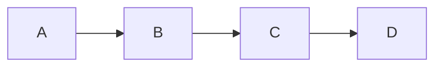

# Caching Basics

> Goal: Understand why caching is critical for performance, how it reduces database load, and how eviction strategies work.

---

## 4.1.1 Why Caching Is Needed ⭐⭐⭐⭐⭐

As systems scale:
- Database becomes bottleneck
- Latency increases
- Cost increases
- Throughput decreases

Instead of hitting the database every time:

```mermaid
graph LR
    User --> App --> Cache --> DB
````

> Cache stores frequently accessed data in memory for faster access.

---

## 4.1.2 What Is Caching?

Caching is the process of:

* Storing frequently accessed data
* In a faster storage layer (usually memory)
* To avoid repeated expensive operations

Expensive operations:

* Database queries
* Computations
* External API calls

---

## 4.1.3 Cache Hit vs Cache Miss

### Cache Hit

Data found in cache → fast response

### Cache Miss

Data not in cache → fetch from DB → store in cache

```mermaid
sequenceDiagram
    App->>Cache: Get(key)
    Cache-->>App: Miss
    App->>DB: Query
    DB-->>App: Data
    App->>Cache: Store
```

---

## 4.1.4 Benefits of Caching ⭐⭐⭐⭐⭐

1. Reduced latency
2. Reduced DB load
3. Increased throughput
4. Better scalability
5. Lower infrastructure cost

> Caching improves both performance and scalability.

---

## 4.1.5 What Should Be Cached?

Good candidates:

* Frequently read data
* Rarely updated data
* Expensive computations

Examples:

* User profiles
* Product catalog
* Configuration data

Avoid caching:

* Highly volatile data
* Critical transactional balances

---

## 4.1.6 Cache Storage Types

### 1️⃣ In-Memory Cache

* Fastest
* Volatile
* Example: Redis, Memcached

### 2️⃣ Disk-Based Cache

* Slower than memory
* More durable

Most systems use memory cache for performance.

---

## 4.1.7 Cache Eviction Strategies ⭐⭐⭐⭐⭐

Cache memory is limited.

When full → some data must be removed.

---

### LRU (Least Recently Used)

Removes the least recently accessed item.



If cache full → remove A (oldest accessed)

✔ Most commonly used
✔ Good general-purpose strategy

---

### LFU (Least Frequently Used)

Removes item accessed least number of times.

✔ Good for skewed workloads
❌ Slightly more complex

---

### FIFO (First In First Out)

Removes oldest inserted item.

✔ Simple
❌ Ignores usage pattern

---

## 4.1.8 TTL (Time To Live)

Each cache entry expires after fixed time.

Example:

```
Cache-Control: max-age=300
```

TTL helps:

* Prevent stale data
* Avoid memory bloat

> TTL is simple but not always sufficient.

---

## 4.1.9 Trade-Offs of Caching

| Benefit            | Trade-Off                     |
| ------------------ | ----------------------------- |
| Faster reads       | Possible stale data           |
| Reduced DB load    | Cache invalidation complexity |
| Better scalability | Memory cost                   |

---

## 4.1.10 Caching in a Payment System

Cache:

* User profile
* Merchant metadata

Do NOT cache:

* Account balance
* Transaction state

> Cache should not compromise correctness.

---

## Key Takeaways ⭐⭐⭐⭐⭐

* Caching reduces latency and DB load
* Cache hit ratio determines effectiveness
* LRU is most commonly used eviction strategy
* TTL prevents indefinite staleness
* Cache is optimization, not source of truth

---

## Interview-Ready One-Liners ⭐

* “Caching reduces database bottlenecks.”
* “LRU is the most common eviction strategy.”
* “Cache is not the source of truth.”
* “High cache hit ratio improves scalability.”