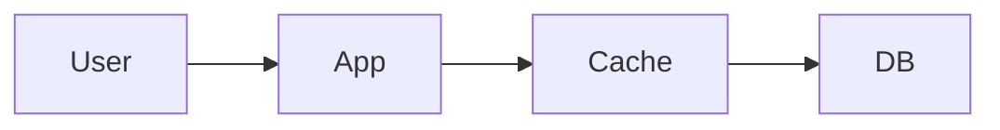
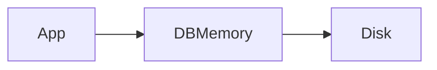
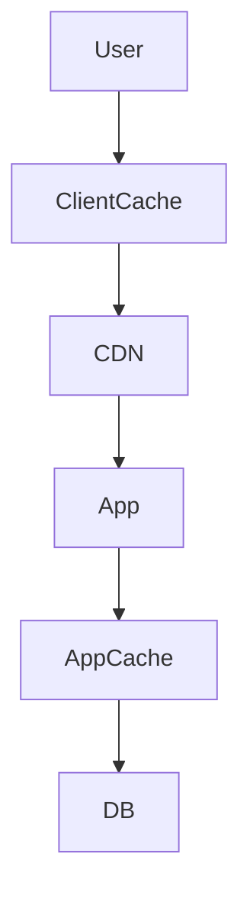

# Cache Placement

> Goal: Understand where caching can be placed in system architecture and how each layer impacts performance and scalability.

---

## 4.2.1 Why Cache Placement Matters ⭐⭐⭐⭐⭐

Caching is not just about storing data —  
it’s about **where** you store it.

Different placements affect:
- Latency
- Scalability
- Consistency
- Infrastructure cost

Modern systems use **multi-layer caching**.

---

## 4.2.2 Client-Side Cache

### What It Is
Data stored in:
- Browser memory
- Browser storage
- Mobile app memory

```mermaid
graph LR
    UserBrowser --> ClientCache --> Server
````

### Examples

* Browser caching static files
* LocalStorage
* Mobile offline cache

### Benefits

* Zero network latency
* Reduces server traffic

### Limitations

* Hard to control invalidation
* Limited storage
* Device-specific

> Best for static content and UI assets.

---

## 4.2.3 CDN (Edge Cache) ⭐⭐⭐⭐⭐

### What It Is

Content cached at global edge servers.

```mermaid
graph TD
    User --> EdgeServer
    EdgeServer --> OriginServer
```

### Used For

* Images
* CSS / JS
* Videos
* Static pages

### Benefits

* Reduces global latency
* Reduces origin load
* DDoS protection

### Limitation

* Not ideal for personalized content

> CDN is user-facing cache.

---

## 4.2.4 Application-Level Cache ⭐⭐⭐⭐⭐

### What It Is

Cache between application and database.



Examples:

* Redis
* Memcached

### Benefits

* Reduces DB load
* Improves API response time
* Shared across instances

### Limitation

* Cache invalidation complexity
* Memory cost

> Most important cache layer in backend systems.

---

## 4.2.5 Database Cache

Some databases:

* Cache query results internally
* Cache frequently accessed pages

Example:

* Buffer pool in relational DB



### Benefits

* Transparent to application
* Improves disk I/O performance

### Limitation

* Less control compared to external cache

---

## 4.2.6 Multi-Level Caching ⭐⭐⭐⭐⭐

Large systems combine:

1️⃣ Client-side cache
2️⃣ CDN
3️⃣ Application cache
4️⃣ Database cache



> Each layer reduces load on the next layer.

---

## 4.2.7 Choosing Cache Placement

Ask:

1. Who should see cached data?
2. How often does data change?
3. Is data user-specific?
4. What is acceptable staleness?

---

## 4.2.8 Cache Placement in a Payment System

### Use CDN

* Static assets
* Public documentation

### Use Application Cache

* Merchant metadata
* Exchange rates

### Avoid Caching

* Account balances
* Active transaction states

---

## 4.2.9 Common Interview Mistakes ❌

❌ Using CDN for personalized APIs
❌ Assuming client cache is reliable
❌ Ignoring invalidation complexity
❌ Forgetting multi-layer caching

✅ Correct thinking:

* Cache as early as possible
* DB remains source of truth
* Combine layers intelligently

---

## Key Takeaways ⭐⭐⭐⭐⭐

* Cache placement impacts latency and scalability
* CDN improves global performance
* Application cache reduces DB load
* Client cache reduces server traffic
* Multi-layer caching is common in real systems

---

## Interview-Ready One-Liners ⭐

* “Cache as close to the user as possible.”
* “CDN reduces global latency.”
* “Application cache reduces database load.”
* “Multi-layer caching improves scalability.”