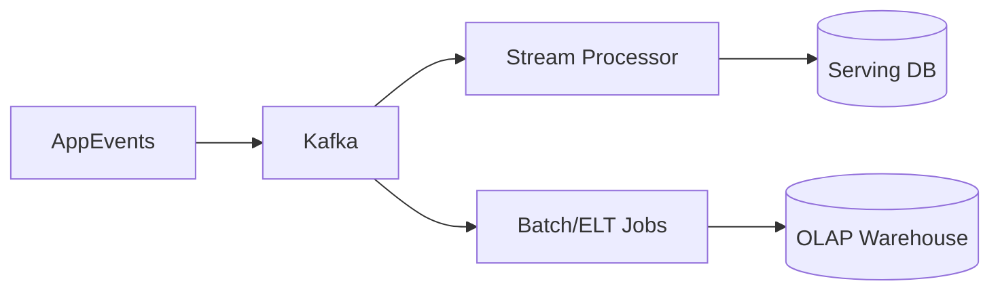

# Stream Processing & Data Pipelines

> Goal: Understand how messaging evolves into data pipelines for analytics, real-time processing, and warehousing.

---
## 5.5.1 Core Concepts

- Batch vs stream processing
- ETL vs ELT
- OLTP vs OLAP
- Event streaming platforms (Kafka)
- Windowing and aggregations
- Data warehouse/lakehouse basics (Spark, warehouse)

---
## 5.5.2 Architecture Overview

---
## 5.5.3 Detailed Explanation

This topic is important in real-world system design because it directly affects reliability, latency, and operational complexity.

Use this as an interview and production checklist:
- Define goals and constraints first
- Choose patterns based on trade-offs
- Add observability and failure handling from day one
- Validate with load/failure tests

---
## 5.5.4 Failure Scenarios and Trade-offs

- Network failures and retries can cause duplicate work if idempotency is missing
- Cross-component coupling increases blast radius
- Operational complexity grows with scale; automate runbooks and alerts
- Correctness vs latency trade-offs must be explicit and documented

---
## 5.5.5 Common Interview Mistakes ❌

❌ Giving definitions without architecture flow
❌ Ignoring failure modes and recovery plans
❌ Not discussing metrics/SLIs for the design
❌ Missing cost and operational trade-offs
