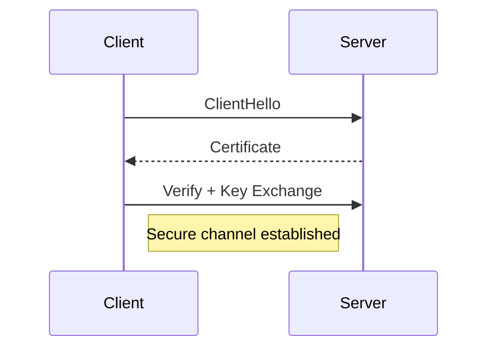

# Network Security

> Goal: Understand how HTTPS and TLS protect data in transit and why secure communication is essential in system design.

---

## 8.1.1 Why Network Security Matters ⭐⭐⭐⭐⭐

In distributed systems:

- Data travels across networks
- Public internet is untrusted
- Attackers can intercept traffic

Without security:
- Passwords can be stolen
- Payment data exposed
- Sessions hijacked
- APIs abused

> All communication over public networks must be secured.

---

# 8.1.2 HTTP vs HTTPS ⭐⭐⭐⭐⭐

## HTTP (HyperText Transfer Protocol)

- Plain text
- No encryption
- Vulnerable to interception

```mermaid
graph LR
    Client --> Server
    Note right of Client: Data visible in transit
````

---

## HTTPS (HTTP Secure)

* Encrypted communication
* Uses TLS
* Ensures confidentiality and integrity

```mermaid
graph LR
    Client -->|Encrypted| Server
```

> HTTPS = HTTP + TLS encryption.

---

# 8.1.3 What Is TLS? ⭐⭐⭐⭐⭐

TLS (Transport Layer Security):

* Cryptographic protocol
* Encrypts data in transit
* Verifies server identity
* Prevents tampering

---

## TLS Provides Three Guarantees

1. Confidentiality → Data encrypted
2. Integrity → Data not modified
3. Authentication → Server identity verified

---

# 8.1.4 TLS Handshake (High-Level) ⭐⭐⭐⭐

Steps:

1. Client sends hello.
2. Server sends certificate.
3. Client verifies certificate.
4. Secure session key established.
5. Encrypted communication begins.



---

# 8.1.5 Certificates ⭐⭐⭐⭐

A certificate:

* Issued by Certificate Authority (CA)
* Verifies server identity
* Contains public key

If certificate invalid:

* Browser shows warning

---

# 8.1.6 Man-in-the-Middle (MITM) Attack ⭐⭐⭐⭐

Without TLS:

Attacker intercepts traffic.


TLS prevents MITM by:

* Encrypting traffic
* Verifying server identity

---

# 8.1.7 Encryption in Transit ⭐⭐⭐⭐⭐

Data encrypted:

* Between client and server
* Between microservices
* Between services and databases

Modern systems often use:

* HTTPS internally
* mTLS (mutual TLS) for service-to-service authentication

---

# 8.1.8 mTLS (Mutual TLS) ⭐⭐⭐⭐

In normal TLS:

* Only server is authenticated.

In mTLS:

* Both client and server authenticate each other.

Used in:

* Microservices
* Zero-trust architectures

---

# 8.1.9 Network Security in Payment System

Critical:

* HTTPS mandatory
* TLS 1.2+ or higher
* mTLS between services
* Strict certificate validation

Never:

* Send sensitive data over HTTP
* Disable certificate validation

---

# 8.1.10 Common Interview Mistakes ❌

❌ Saying HTTPS is optional
❌ Confusing TLS with encryption at rest
❌ Ignoring certificate validation
❌ Not mentioning mTLS for internal services

✅ Correct thinking:

* Encrypt all traffic
* Verify identity
* Use strong TLS versions
* Protect internal communication too

---

# Key Takeaways ⭐⭐⭐⭐⭐

* HTTP is insecure
* HTTPS uses TLS
* TLS provides confidentiality, integrity, authentication
* Certificates verify identity
* mTLS secures service-to-service communication

---

# Interview-Ready One-Liners ⭐

* “HTTPS = HTTP over TLS.”
* “TLS provides confidentiality, integrity, authentication.”
* “Encrypt data in transit.”
* “Use mTLS for internal services.”